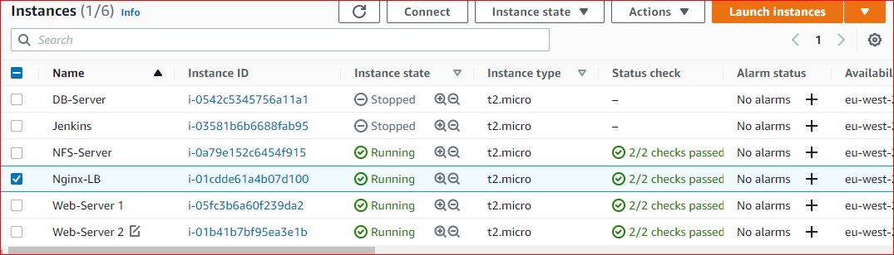

## PROJECT 10: Load Balancer Solution With Nginx and SSL/TLS
---
**Task :**

This project consists of two parts:

1. Configure **Nginx** as a Load Balancer

2. Register a new **domain name** and configure secured connection using **SSL/TLS** certificates.

**Project architecture :**
---


**CONFIGURE NGINX AS A LOAD BALANCER**

- Create an EC2 VM based on **Ubuntu Server** 20.04 LTS and name it **Nginx LB** and open TCP port **80** for **HTTP** connections, also TCP port **443** for secured **HTTPS** connections

  

  

- Update **/etc/hosts** file for local DNS with **Web Servers’** names (e.g. **Web1** and **Web2**) and their local **IP addresses**
  ```
  #Open this file on my Nginx-LB server

  sudo vi /etc/hosts

  #Add 2 records into this file with Local IP address and arbitrary name for both of my Web Servers

  <WebServer1-Private-IP-Address> Web1
  <WebServer1-Private-IP-Address> Web1
  ```

  

 
- Install and configure **Nginx** as a **load balancer** to point traffic to the resolvable DNS names of the **webservers**
 
  `sudo apt update`

  `sudo apt install nginx`

- I'll configure **Nginx LB** using the Web Servers’ names **(web1&web2)** I defined in **/etc/hosts**

  Open the default nginx configuration file

  `sudo vi /etc/nginx/nginx.conf`
  ```
  #insert following configuration into http section

  upstream myproject {
     server Web1 weight=5;
     server Web2 weight=5;
   }

  server {
      listen 80;
      server_name www.domain.com;
      location / {
        proxy_pass http://myproject;
      }
    }

  #comment out this line
  #       include /etc/nginx/sites-enabled/*;
  ```
  

- Restart Nginx and make sure the service is up and running

  `sudo systemctl restart nginx`

  `sudo systemctl status nginx`  

### REGISTER A NEW DOMAIN NAME AND CONFIGURE SECURED CONNECTION USING **SSL/TLS** CERTIFICATES

- In order to get a valid **SSL** certificate, i'll need to register a new **domain name**

1. I bought and register a new domain name using AWS **Route 53** service