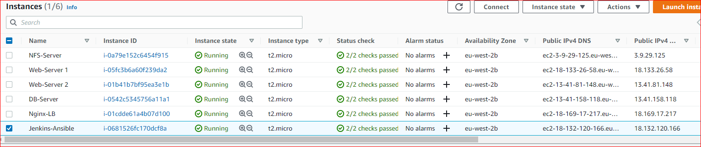

## ANSIBLE CONFIGURATION MANAGEMENT – AUTOMATE PROJECT 7 TO 10
---
**Project Architecture:**


**Task**

In this Project, I'll write an **ansible** scripts to simulate the use of a **Jump box/Bastion host** to access my **Web Servers**.

1. Install and configure **Ansible** client to act as a **Jump Server/Bastion Host**

2. Create a simple **Ansible playbook** to automate servers configuration.

### **INSTALL AND CONFIGURE ANSIBLE ON EC2 INSTANCE**
---

1. Update Name tag on my **Jenkins** EC2 Instance to **Jenkins-Ansible**. I will use this server to run **playbooks**.

   

2. In my **GitHub** account I'll create a new repository and name it **ansible-config-mgt**.

3. Instal Ansible

   `sudo apt update`

   `sudo apt install ansible`

   Check my Ansible version by running `ansible --version`

   

4. Configure **Jenkins** build job to save my repository content every time i change it   

   - Create a new Freestyle project **ansible** in Jenkins and point it to my **‘ansible-config-mgt’** repository 

     

     

   - Configure **Webhook** in GitHub and set webhook to trigger **ansible** build.

     

   - Configure a **Post-build** job to save all (**) files

     

5. Test my setup by making some change in **README.MD** file in master branch and make sure that builds starts automatically and Jenkins saves the files (build artifacts) in following folder

   

   

   `ls /var/lib/jenkins/jobs/ansible/builds/<build_number>/archive/`

   

### **Prepare my development environment using Visual Studio Code** 
---

- I already have **Visual studio code** installed and some extensions like **Remote development pack**. 

  I'll configure my **VS Code** to connect to my newly created GitHub repository **"ansible-config-mgt"**
      
    - In my VS Code go to **File** > **New window** Click **Clone Repository** > Clone from Github

      

#### **BEGIN ANSIBLE DEVELOPMENT :**
---

1. In my **ansible-config-mgt** GitHub repository, I'll create a new **branch** name **prj-11** that will be used for development of a new feature.

   - Using `git branch` confirm my current branch

     

   - Using `git checkout -b prj-11` to create a new branch **prj-11**  and switch to the branch

     

2. Confirm my new branch **"prj-11"**    

     `git branch`

     `git status`

     

3. I'll create a directory and name it **playbooks** – it will be used to store all my **playbook files**.

   `mkdir playbooks`

4. I'll create a directory and name it **inventory** – it will be used to keep my hosts organised.

   `mkdir inventory`

5. Within the **playbooks** folder, I'll create my first playbook file, and name it **common.yml**

   `cd playbooks`

   `touch common.yml`

6. Within the **inventory** folder, i'll create an inventory file (.yml) for each environment (Development, Staging Testing and Production) **dev, staging, uat,** and **prod** respectively. 

   `cd inventory`

   `touch dev.yml staging.yml uat.yml prod.yml`

   

### **Set up an Ansible Inventory :**  
---
**Note:** Ansible uses TCP port **22** by default, which means it needs to **ssh** into **target servers** from **Jenkins-Ansible** host – for this i'll need to import my **.pem key** into **ssh-agent:** 

- On my terminal using GitBash i run the below command: 
  
      # Using commant below, check the Agent id:
        eval `ssh-agent -s`

      # Add my .pem key
      ssh-add <path-to-private-key>

      # Confirm the key has been added

      ssh-add -l
  
  

- Now, i'll **ssh** into my **Jenkins-Ansible server** using **ssh-agent**

  Also notice, that my **Jenkins-Ansible** is **ubuntu** server and **user name** is ubuntu and user name for **RHEL-based** servers is **ec2-user**.

  `ssh -A ubuntu@public-ip`  

  

NOTE: My **Jenkins-Ansible** server which is now acting as my **Bastion Host** will now be able to access other **servers** who has same **.pem key**

 - To confirm, Using my **Ansible-server**, i will **ssh** into my **web server** which is a **RHEL** instance **(Username: ec2-user)**

   `ssh ec2-user@<web-server-Public/Private-IP>`

   

- Now i'll update my **inventory/dev.yml** file with this snippet of code:
   ```
  [nfs]
  <NFS-Server-Private-IP-Address> ansible_ssh_user='ec2-user'

  [webservers]
  <Web-Server1-Private-IP-Address> ansible_ssh_user='ec2-user'
  <Web-Server2-Private-IP-Address> ansible_ssh_user='ec2-user'

  [db]
  <Database-Private-IP-Address> ansible_ssh_user='ec2-user' 

  [lb]
  <Load-Balancer-Private-IP-Address> ansible_ssh_user='ubuntu'   
  ```
   

### **CREATE A COMMON PLAYBOOK :**
---      
- In **common.yml** playbook i'll write configuration for repeatable, re-usable, and multi-machine tasks that is common to systems within the infrastructure.

  I'll update my **playbooks/common.yml** file with following code:
  ```
  ---
  - name: update web and nfs servers
    hosts: webservers, nfs
    remote_user: ec2-user
    become: yes
    become_user: root
    tasks:
      - name: ensure wireshark is at the latest version
        yum:
          name: wireshark
          state: latest


  # ------------------------------------------        

  - name: update LB and db servers
    hosts: lb, db
    remote_user: ubuntu
    become: yes
    become_user: root
    tasks:
      - name: Update apt repo
        apt: 
          update_cache: yes

      - name: ensure wireshark is at the latest version
        apt:
          name: wireshark
          state: latest 

  ```

  This **playbook** is divided into two parts, each of them is intended to perform the same task: install **wireshark** utility (or make sure it is updated to the latest version) on my **RHEL 8** and **Ubuntu** servers. 

  It uses **root** user to perform this task and respective package manager: **yum** for **RHEL 8** and **apt** for **Ubuntu** 

### **Update GIT with the latest code**
--- 
All of my directories and files live on my machine and i need to push changes made locally to **GitHub** . 

1. Commit my code into my GitHub branch (prj-11)

   `git status`
   
   `git add .`

   `git commit -m 'new update'`

   `git push origin prj-11`

   

   

2. Create a pull request for branch **(prj-11)**. Then merge the code in **prj-11** into the **master** branch

   

   

   

3. Since branch **(Prj-11)** has been merged to **main** branch, 
code changes will now appear in **master/main** branch

   

   After the successful merge, **Jenkins** will automatically do its **job** and create a **build** 

   

   **Jenkins** will save all the files **(build artifacts)** to `ls /var/lib/jenkins/jobs/ansible/builds/<build_number>/archive/` directory on **Jenkins-Ansible server**.

   

### **RUN FIRST ANSIBLE TEST**
---
Now, it is time to execute **ansible-playbook** command and verify if my playbook actually works.

Now, i'll ensure i have **ssh** into my **Jenkins-Ansible server** remotely from **VScode**

Since i already has **development pack** extension installed in my **VScode** which has **remote ssh**

At bottom left. click on Open a **remote window** > **connect to Host** > `ssh ubuntu@<public-IP>` > **click linux** which opens a new **VScode** window


**NOTE :** I was getting error trying to connect remotely so i check the **ssh config**file in my **VScode** ensure to update the file with code below if not present. Then try to connect again

```
Host jenkins-ansible
    HostName <Public-IP>
    User ubuntu
    IdentityFile /Users/USER/Downloads/kriz-ec2.pem
    ForwardAgent yes
    ControlPath /tmp/ansible-ssh-%h-%p-%r
    ControlMaster auto
    ControlPersist 10m
```


After updating the **ssh configuration** and try to connect remotely again to my server, it was now successful.

But i was unable to run **ansible playbook** on the host with permission error


On my main **VScode** window where i have my playbook and inventory folder. I added my identity key again and ssh to my jenkins-ansible server using ssh agent `ssh -A ubuntu@<public-IP>` 


I ran my playbook by pasting the link below on my **anisble server** which already has my identity key(.pem) which is unique to all my servers and will enable my **jenkins-ansible** server to ssh into all my server that my **playbook** will perform a **task** on:

`ansible-playbook -i /var/lib/jenkins/jobs/ansible/builds/<builds-number>/archive/inventory/dev.yml /var/lib/jenkins/jobs/ansible/builds/<build-number>/archive/playbooks/common.yml`

Playbook was successful.


### **Confirm That Ansible Playbook has perform its task on each of the servers**
---
- I'll go to each of the **servers** and check if **wireshark** has been installed by running **which wireshark** or **wireshark --version**
    
    - Go to **web server** and confirm **wireshark** is installed

      

    - Go to **db server** and confirm **wireshark** is installed 

       

### **Update my Playbook with another Task**
---
I'll update my playbook with following tasks:

 1. Create a directory **"kris_folder"** and a file **"ansible.txt"** inside it

 2. Change **timezone** on all servers
 ```
- name: create directory, file and set timezone on all servers
  hosts: webservers, nfs, lb, db
  become: yes
  tasks:

    - name: create a directory
      file:
        path: /home/kris_folder
        state: directory

    - name: create a file
      file:
        path: /home/kris_folder/ansible.txt
        state: touch

    - name: set timezone
      timezone:
        name: Africa/Lagos
```        


After updating my **ansible playbook** with some new **Ansible tasks** i'll go through the full **checkout** -> **change codes** -> **commit** -> **PR** -> **merge** -> **build** -> **ansible-playbook**
 
 On Branch **prj-11**

 `git status` > `git pull` > `git add .` > `git commit` > `git push origin prj-11`

 

- Now i'll run my ansible playbook on my jenkins-ansible server with the latest builds that has been created automatically in jenkins.

`ansible-playbook -i /var/lib/jenkins/jobs/ansible/builds/17/archive/inventory/dev.yml /var/lib/jenkins/jobs/ansible/builds/17/archive/playbooks/common.yml`


Goto my servers to confirm that the task in play book has been created in each of the servers.


### **END OF PROJECT.......**

