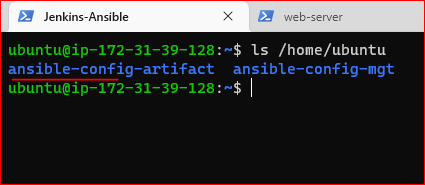
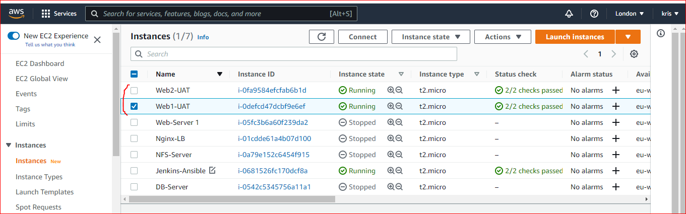
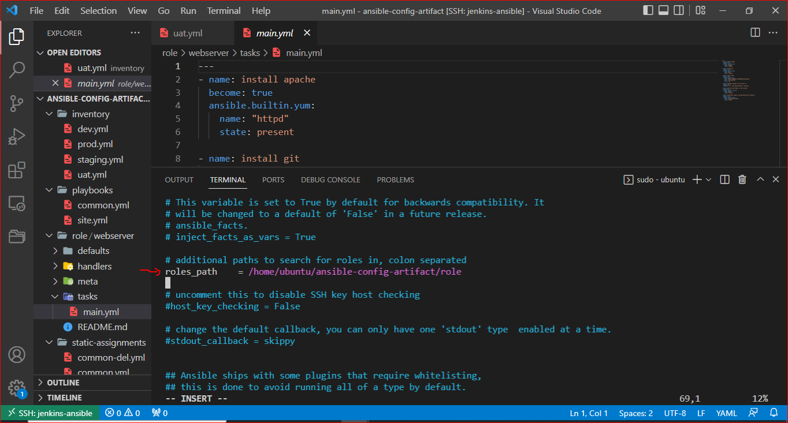

## **ANSIBLE REFACTORING AND STATIC ASSIGNMENTS (IMPORTS AND ROLES)**
---
In this project i'll continue working with **ansible-config-mgt** repository and make some improvements of my code. I'll need to **refactor** my **Ansible code**, **create assignments**, and use the **imports functionality**. Imports allow to effectively re-use previously created **playbooks** in a new **playbook**

### **Step 1 – Jenkins job enhancement**
---
I'll make some changes to my **Jenkins job** – now every new change in the codes creates a separate directory which is not very convenient when i want to run some commands from one place. Besides, it consumes space on Jenkins servers with each subsequent change. I'll enhance it by introducing a new **Jenkins project/job** – I will require **Copy Artifact** plugin

1. Go to my **Jenkins-Ansible** server and create a new directory called **ansible-config-artifact** – I will store there all **artifacts** after each **build**.

   `sudo mkdir /home/ubuntu/ansible-config-artifact`

   

2. Change permissions to this directory, so **Jenkins** could save files there 

   `sudo chmod -R 0777 /home/ubuntu/ansible-config-artifact`

3. Go to **Jenkins web console** -> **Manage Jenkins** -> **Manage Plugins** -> on **Available** tab search for **Copy Artifact** and install this plugin without restarting **Jenkins**

   

4. I'll create a new **Freestyle project** and name it **save_artifacts**.   

   

5. This project will be triggered by completion of my existing **ansible project**. I'll Configure it accordingly:

   On **General Tab**, Click **Discard old build** and configure see screenshoot below

   

   source code management -> Build Trigger see screenshot below:

   

6. The main idea of **save_artifacts** project is to **save artifacts** into **/home/ubuntu/ansible-config-artifact** directory. 

   To achieve this, i'll add a **Build step** and choose **Copy artifacts from another project**, specify **ansible** as a **source project** and **/home/ubuntu/ansible-config-artifact** as a **target** directory.

   

7. Now i'll test my set up by making some change in **README.MD** file inside my **ansible-config-mgt** repository (right inside master branch).

   

   If both Jenkins jobs **(ansible and save_artifacts)** have completed one after another – I'll see my files inside **/home/ubuntu/ansible-config-artifact** directory and it will be updated with every commit to my **master** branch.   

   

### **Step 2 – Refactor Ansible code by importing other playbooks into site.yml**   
---
Before starting to **refactor the codes**, I'll ensure that i have pulled down the latest code from **master (main)** branch, and created a new branch, and named it **refactor**

 create a new branch **"refactor"** and switch to the branch using : `git checkout -b refactor`

  

1. Within **playbooks** folder, I'll create a new file and name it **site.yml** – 

   This file will be considered as an entry point into the entire infrastructure configuration. Other **playbooks** will be included here as a **reference**. In other words, **site.yml** will become a **parent** to all other **playbooks** that will be developed. Including **common.yml** that i created previously

    `touch playbooks/site.yml`

   

2. I'll create a new folder in root of the repository and name it **static-assignments**. The static-assignments folder is where all other children **playbooks** will be stored.   

   `mkdir static-assignments`
   
    

3. Move **common.yml** file into the newly created **static-assignments** folder.

   

4. Inside **site.yml** file, import **common.yml** playbook.
    ```
    ---
   - hosts: all
   - import_playbook: ../static-assignments/common.yml
    ``` 
   **NOTE:** The code above uses built in **import_playbook** Ansible module.

   Using **vim editor**, I'll paste the code above inside **site.yml** file 
 
   `vi playbooks/site.yml` 

   

5. Run **ansible-playbook** command against the **dev** environment

   Since I'll need to apply some tasks to my **dev servers** and **wireshark** is already installed. I'll create another **playbook** under **static-assignments** and name it **common-del.yml**. In this playbook, I'll configure **deletion** of **wireshark** utility.  

   `touch static-assignments/common-del.yml`

   

   I'll copy and paste the code below into **common-del.yml**

   ```
   ---
     - name: update web and nfs servers
       hosts: webservers, nfs
       remote_user: ec2-user
       become: yes
       become_user: root
       tasks:
       - name: delete wireshark
         yum:
           name: wireshark
           state: removed


   # -------------------------------------      

     - name: update LB and db server
       hosts: lb, db
       remote_user: ubuntu
       become: yes
       become_user: root
       tasks:
       - name: delete wireshark
         apt:
           name: wireshark-qt
           state: absent
           autoremove: yes
           purge: yes
           autoclean: yes

    ```
   Now i'll update **site.yml** with - **import_playbook: ../static-assignments/common-del.yml** instead of **common.yml** and run it against **dev servers**:

   
   
   Now i'll run the **ansible playbook** command which will delete **wireshark** on all servers.

   ```
   cd /home/ubuntu/ansible-config-mgt/

   ansible-playbook -i inventory/dev.yml playbooks/site.yaml
   ```
    Confirm that my identity key is present,then using ssh Agent, to access my ansible server

    `ssh-add -l`
    
    `ssh -A ubuntu@public-ip`

    

    Confirm that my ansible server can access other servers

    `ssh ec2-user@<web-server-Public/Private-IP>`

    

    NOTE: All of my directories and files live on my machine and i need to push changes made locally to GitHub

    Now i will Commit my latest **code** into my GitHub branch **(refactor)** 
    
    Then create pull request, compare, and merge pull request to the main branch

    `git status`

    `git add .`

    `git commit -m 'new update'`

    `git push origin refactor`

    

    On merging code to the main branch, my Jenkins Job has been built.

    


    Now i'll run my **playbook:**

    `ansible-playbook -i /var/lib/jenkins/jobs/ansible/builds/<builds-number>/archive/inventory/dev.yml /var/lib/jenkins/jobs/ansible/builds/<builds-number>/archive/playbooks/site.yml`   

    

    Now i'll check to ensure that **wireshark** is deleted on all the servers by running **wireshark --version**

    

    

### **Step 3 – Configure UAT Webservers with a role ‘Webserver’**
---
I now have my nice and clean **dev** environment, so i'll put it aside and configure 2 new **Web Servers** as **uat**. I could write tasks to configure **Web Servers** in the same **playbook**, but it would be too messy, instead, I will use a dedicated **role** to make my **configuration** reusable.

1. Launch 2 new **EC2 instances** using **RHEL 8** image, I will use them as my **uat servers**, so i will name them – **Web1-UAT** and **Web2-UAT**. 

   

2. To create a **role**, i must create a directory called **roles/**, relative to the playbook file or in /etc/ansible/ directory.

   There are two ways how i can create this folder structure:

   - Create the directory/files structure **manually**

   - Or use an Ansible utility called **ansible-galaxy** inside **ansible-config-mgt/roles** directory (i need to create roles directory upfront)
     ```
     mkdir roles
     cd roles
     ansible-galaxy init webserver
     ```

     **Note:** I can choose either way, but since i store all my codes in **GitHub**, it is recommended to create folders and files there rather than locally on **Jenkins-Ansible server**. So i created my role manually

     
     
     

3. i'll update my **inventory ansible-config-mgt/inventory/uat.yml** file with **IP addresses** of my 2 **UAT** Web servers 
   ```
   [uat-webservers]
   <Web1-UAT-Server-Private-IP-Address> ansible_ssh_user='ec2-user' 

   <Web2-UAT-Server-Private-IP-Address> ansible_ssh_user='ec2-user' 
   ```
   

4. In **/etc/ansible/ansible.cfg** file, i'll uncomment **roles_path** string and provide a full path to my roles directory **roles_path    = /home/ubuntu/ansible-config-mgt/roles**, so **Ansible** could know where to find configured **roles**. 

   - ssh into my **ansible server** and edit the file using **vi editor**
   
     `sudo vi /etc/ansible/ansible.cfg`

     

5. It is time to start adding some logic to the **webserver role**. I'll go into **tasks** directory, and within the **main.yml** file, start writing configuration tasks to do the following:

   - Install and configure Apache **(httpd service)**
   - Clone **Tooling** website from **GitHub** `https://github.com/<your-name>/tooling.git`.
   - Ensure the tooling website code is deployed to **/var/www/html** on each of 2 **UAT Web servers**.
   - Make sure **httpd** service is started

   my **main.yml** will consist of following tasks:
   ```
   ---
   - name: install apache
     become: true
     ansible.builtin.yum:
       name: "httpd"
       state: present

   - name: install git
     become: true
     ansible.builtin.yum:
       name: "git"
       state: present

   - name: clone a repo
     become: true
     ansible.builtin.git:
       repo: https://github.com/<your-name>/tooling.git
       dest: /var/www/html
       force: yes

   - name: copy html content to one level up
     become: true
     command: cp -r /var/www/html/html/ /var/www/

   - name: Start service httpd, if not started
     become: true
     ansible.builtin.service:
       name: httpd
       state: started

   - name: recursively remove /var/www/html/html/ directory
     become: true
     ansible.builtin.file:
       path: /var/www/html/html
       state: absent
   ```
### **Step 4 – Reference ‘Webserver’ role**
---
Within the **static-assignments** folder, I'll create a new assignment for uat-webservers named **uat-webservers.yml**. That is where i will reference the role.
```
---
- hosts: uat-webservers
  roles:
     - webserver
```


Note that the entry point to my **ansible configuration** is the **site.yml** file. Therefore, i need to refer my **uat-webservers.yml** role inside **site.yml**.

So, i'll add the code below to **site.yml**. I'll comment the rest code so that the desired code will run
```
- hosts: uat-webservers
- import_playbook: ../static-assignments/uat-webservers.yml
```


### **Step 5 – Commit & Test**
---
Now i'll **commit** my changes, create a **Pull Request** and **merge** them to **master branch**, make sure **webhook** triggered **two** consequent **Jenkins jobs**, they ran successfully and copied all the files to my **Jenkins-Ansible server** into **/home/ubuntu/ansible-config-mgt/** directory.

Now i'll run the **playbook** against my **uat inventory** and see what happens:

`ansible-playbook -i /home/ubuntu/ansible-config-artifact/inventory/uat.yml /home/ubuntu/ansible-config-artifact/playbooks/site.yml`


Now i can see both of my **UAT Web servers** configured and i can try to reach them from my browser: http://18.134.3.219/index.php


My Ansible architecture now looks like this:


### **END OF PROJECT .....**
---