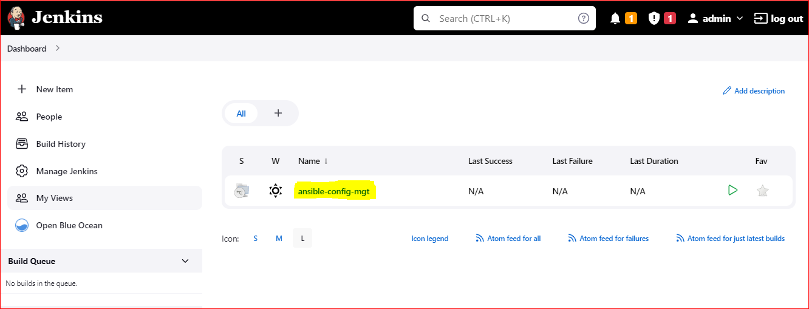

## EXPERIENCE CONTINUOUS INTEGRATION WITH JENKINS | ANSIBLE | ARTIFACTORY | SONARQUBE | PHP
---
In this project, the concept of CI/CD is implemented whereby php application from github are pushed to Jenkins to run a multi-branch pipeline job(build job is run on each branches of a repository simultaneously) which is better viewed from Blue Ocean plugin. This is done in order to achieve continuous integration of codes from different developers. After which the artifacts from the build job is packaged and pushed to sonarqube server for testing before it is deployed to artifactory from which ansible job is triggered to deploy the application to production environment.

### **STEP 0: Setting Up Servers**
---
I launched 3 EC2 Instances, one for Jenkins server, another for MySQL database(RedHat) and another is used for SonarQube Server

**On Jenkins server :**
---

1. ssh into the **Jenkins server** via **ssh agent** in my **VScode**
2. Install **git** in my **Jenkins server** so as to be able to clone my github repository: `sudo yum install git -y`

   

3. Clone my repo: `git clone https://github.com/Amae69/ansible-config.git`  

   

4. Open folder of the repo and check the **README** file for dependences to be installed

   

5. change directory to the home directory and switch to rool user: 

   `cd ..`

   `sudo su`

6. Install jenkins following instruction Link 'https://www.jenkins.io/doc/book/installing/` 

```
# install wget
sudo yum install wget -y

sudo yum upgrade

sudo wget -O /etc/yum.repos.d/jenkins.repo \
    https://pkg.jenkins.io/redhat-stable/jenkins.repo

sudo rpm --import https://pkg.jenkins.io/redhat-stable/jenkins.io.key

# Check README file in ansible-config repo to get dependences to be installed with Jenkins

- yum install -y https://dl.fedoraproject.org/pub/epel/epel-release-latest-8.noarch.rpm

- yum install -y dnf-utils http://rpms.remirepo.net/enterprise/remi-release-8.rpm

# install java
sudo yum install java-11-openjdk-devel -y

# open the bash profile 
  vi .bash_profile 

# paste the below in the bash profile

export JAVA_HOME=$(dirname $(dirname $(readlink $(readlink $(which javac)))))
export PATH=$PATH:$JAVA_HOME/bin
export CLASSPATH=.:$JAVA_HOME/jre/lib:$JAVA_HOME/lib:$JAVA_HOME/lib/tools.jar  

# reload the bash profile
source ~/.bash_profile

# Now install jenkins
# exit root user

sudo yum install jenkins
```
`sudo systemctl start jenkins`

`sudo systemctl enable jenkins`

`sudo systemctl status jenkins`

`sudo systemctl daemon-reload`


### **STEP 1: Configuring Ansible For Jenkins Deployment**
---
In previous projects, I have been launching **Ansible** commands manually from a **CLI**. Now, with Jenkins, I will start running Ansible from **Jenkins UI**.

- Open Jenkins UI on browser `http://13.41.189.40:8080`

- get the password and install suggested plugins and create first admin user

  


In order to run ansible commands from Jenkins UI, the following outlines the steps taken:

- Install Blue Ocean plugin:

  `manage jenkins > manage plugin > Available`

   

- Creating new pipeline job on the Blue Ocean UI and select Github

- Generating new personal access token in order to connect to GitHub and get full access to the repository

- Pasting the token and selecting ansible-config-mgt repository to create a new pipeline job

  

At this point i do not have a **Jenkinsfile** in the **Ansible repository**, so **Blue Ocean** will attempt to give me some guidance to create one. But I will rather create one myselves. So, click on **Administration** to exit the **Blue Ocean** console.  

Here is my newly created **pipeline**. It takes the name of my **GitHub** repository



### **Now i'll create my Jenkinsfile**
---

- Creating a directory in the root of **ansible-config-mgt** directory called **deploy**, and creating a file in it called **Jenkinsfile**.

  Add the code snippet below to start building the **Jenkinsfile** gradually. This pipeline currently has just one **stage** called **Build** and the only thing we are doing is using the shell script module to echo Building Stage
  ```
  pipeline {
    agent any

  stages {
    stage('Build') {
      steps {
        script {
          sh 'echo "Building Stage"'
        }
      }
    }
    }
  }
   ```

### **Commit the change**
---
`git add .`

`git commit -m 'add jenkins file'`

`git push origin main`


Now i'll go back into the Ansible pipeline in Jenkins, and select configure. This will trigger a build automatic

`ansible-config-mgt > configure > build configuration`


Open blue ocean to see build:


Notice that this pipeline is a multibranch one. This means, if there were more than one branch in GitHub, Jenkins would have scanned the repository to discover them all and trigger a build for each branch.

Let us see this in action.

- Now i,ll Create a new git branch and name it **feature/jenkinspipeline-stages**

  `git checkout -b feature/Jenkinspipeline-stages`

  Update my local branch **feature/Jenkinspipeline-stages** with the latest code as it is behind the remote **main** branch

  `git pull`

  Currently we only have the **Build** stage. Let us add another **stage** called **Test**. Paste the code snippet below and push the new changes to GitHub.

  ```
  pipeline {
    agent any

  stages {
    stage('Build') {
      steps {
        script {
          sh 'echo "Building Stage"'
        }
      }
    }

    stage('Test') {
      steps {
        script {
          sh 'echo "Testing Stage"'
        }
      }
    }
    }
  }
  ```
  `git add .`

  `git commit -m 'add test stage'`

  `git push`

  `git push --set-upstream origin feature/Jenkinspipeline-stages`

Now i'll Create a **pull request** for **'feature/Jenkinspipeline-stages'** on **GitHub** by visiting:
remote:      https://github.com/Amae69/ansible-config-mgt/pull/new/feature/Jenkinspipeline-stages

- To make my new **branch** show up in **Jenkins**, I need to tell Jenkins to **scan the repository**.

1. Click on the **"Administration"** button
2. Navigate to the **Ansible project** and click on **"Scan repository now"**


   open blueocen console to see new branch build

   

   

### **Quick Task**
---
```
1. Create a pull request to merge the latest code into the main branch
2. After merging the PR, go back into your terminal and switch into the main branch.
3. Pull the latest change.
4. Create a new branch, add more stages into the Jenkins file to simulate below phases. (Just add an echo command like we have in build and test stages)
   1. Package 
   2. Deploy 
   3. Clean up
5. Verify in Blue Ocean that all the stages are working, then merge your feature branch to the main branch
6. Eventually, your main branch should have a successful pipeline like this in blue ocean
```
