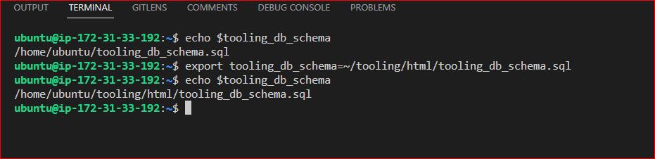

## **MIGRATION TO THE CLOUD WITH CONTAINERIZATION - DOCKER**
---
### **INTRODUCTION**
In this project, we **migrate** the **Tooling** Web Application from a **VM-based** solution into a **containerized** one. The frontend and the backend(MySQL) of tooling application is built and containerized using DOCKER of which its image is pushed to Docker registry. And further in the project, the php-todo application is also built into a container and pushed into the AWS Elastic Container Registry using a CI/CD tool known as Jenkins and Docker Compose is also implemented.

The following outlines the steps:

### **STEP 0: Install Docker and prepare for migration to the Cloud**

First, i need to install [Docker Engine](https://docs.docker.com/engine/install/), which is a **client-server** application that contains:

- A server with a long-running daemon process dockerd.
- APIs that specify interfaces that programs can use to talk to and instruct the Docker daemon.
- A command-line interface (CLI) client docker.

I can start with my own workstation or spin up an **EC2 instance** to install **Docker engine** that will host my **Docker containers**.

1. I launched an **ubuntu** OS Linux server to install [Docker Engine](https://docs.docker.com/engine/install/ubuntu/)


   - Update package: `sudo apt update` 

  

   - Installed the necessary dependencies
   ```
   # Install packages to allow apt to use a repository over HTTPS:

  sudo apt-get install \
      ca-certificates \
      curl \
      gnupg \
      lsb-release

   # Add Docker’s official GPG key:

   sudo mkdir -p /etc/apt/keyrings

curl -fsSL https://download.docker.com/linux/ubuntu/gpg | sudo gpg --dearmor -o /etc/apt/keyrings/docker.gpg

curl -fsSL https://download.docker.com/linux/ubuntu/gpg | sudo gpg --dearmor -o /usr/share/keyrings/docker-archiv
e-keyring.gpg

  # Use the following command to set up the repository:

  echo \
  "deb [arch=$(dpkg --print-architecture) signed-by=/etc/apt/keyrings/docker.gpg] https://download.docker.com/linux/ubuntu \
  $(lsb_release -cs) stable" | sudo tee /etc/apt/sources.list.d/docker.list > /dev/null
 ```

   

   - Install Docker Engine `sudo apt-get install docker-ce docker-ce-cli containerd.io docker-compose-plugin`

 

   - Verify that the **Docker Engine** installation is successful by running the **hello-world image**:
   
     `sudo docker run hello-world`


### MySQL in container
---
I will use a **pre-built MySQL** database container, configure it, and make sure it is ready to receive requests from my **PHP** application.

### **Step 1: Pull MySQL Docker Image from Docker Hub Registry**

`sudo docker pull mysql/mysql-server:latest`


List the images to check that i have downloaded them successfully:

`sudo docker image ls`


### **Step 2: Deploy the MySQL Container to my Docker Engine**

Now I have the image, I'll move on to deploying a new **MySQL container** with:
`docker run --name <container_name> -e MYSQL_ROOT_PASSWORD=<my-secret-pw> -d mysql/mysql-server:latest`

Then check to see if the **MySQL container** is running: `sudo docker ps -a`


### **Step 3: Connecting to the MySQL Docker Container**
---
I can either connect directly to the container running the **MySQL server** or use a second container as a **MySQL client**

#### **Approach 1**
Connecting directly to the container running the MySQL server:`docker exec -it mysql bash` OR `docker exec -it mysql mysql -uroot -p`


#### **Approach 2**
At this stage, i have create a **docker** container but i will need to add a **network**. So, i'll stop and remove the previous **mysql docker container**.

`sudo docker ps -a`

`sudo docker stop mysql`

`sudo docker rm mysql` 

verify that the container is deleted: `sudo docker ps -a`
 


### **Create a custom network:**
---

**NOTE:** Creating a **custom network** is not necessary because even if i do not create a network, Docker will use the **default network** for all the **containers** i run. By default, the network we created above is of **DRIVER Bridge**. So, it becomes the **default network**. I can verify this by running:`sudo docker network ls` command.

- Creating a **custom network** with a **subnet** dedicated for both **MySQL** and the **Tooling** application so that they connect: 

  `sudo docker network create --subnet=172.18.0.0/24 tooling_app_network`


- Creating an **environment variable** to store the **root password**: `export MYSQL_PW=password`

  verify the environment variable is created: `echo $MYSQL_PW`


- In one command, Pulling the **MySQL image** and running the container: 

  `sudo docker run --network tooling_app_network -h mysqlserverhost --name=mysql-server -e MYSQL_ROOT_PASSWORD=$MYSQL_PW -d mysql/mysql-server:latest` 

  If the image is not found locally, it will be downloaded from the registry.

- Verify the container is running: `sudo docker ps -a`   


**NOTE:** Because it's not a good practice to connect to **MySQL server** remotely using the **root user**.I will create an **SQL script** that will create a **user** i can use to connect remotely.

- I'll Create a file named **create_user.sql** and edit the file to input code 

  `sudo touch create_user.sql && sudo vi create_user.sql`

  Add the following code in order to create a user:

  `CREATE USER 'kris'@'%' IDENTIFIED BY 'password'; GRANT ALL PRIVILEGES ON * . * TO 'kris'@'%';`  
  


- Running the script to create the new user (Ensure am in the directory **create_user.sql** file is located or declare a path): 

  `sudo docker exec -i mysql-server mysql -uroot -p$MYSQL_PW < create_user.sql`  


- Connecting to the MySQL server from a second container running the MySQL client utility: 

  Run the MySQL Client Container, if image is not present locally, it will pull and download:

  `docker run --network tooling_app_network --name mysql-client -it --rm mysql mysql -h mysqlserverhost -u -p` 

 


### **STEP 4: Preparing The Database Schema**
---
I'll prepare a **database** schema so that the **Tooling** application can connect to it.

1. Clone the Tooling-app repository from [here](https://github.com/darey-devops/tooling)

   `git clone https://github.com/darey-devops/tooling.git`


2. Exporting the location of the SQL file that contains data for setting up the MySQL database: 

   `export tooling_db_schema=~/tooling_db_schema.sql`

   The **tooling_db_schema.sql** is found in the **tooling/html/tooling_db_schema.sql** folder of **cloned repo**.  

   Verify that the path is exported: `echo $tooling_db_schema` 


3. Using the **SQL script** to create the database and prepare the schema: 

   `docker exec -i mysql-server mysql -uroot -p$MYSQL_PW < $tooling_db_schema`



4. Update the **.env** file with connection details to the database.

   The **.env** file is located in the **html** **tooling/html/.env** folder. Using **VI** editor to edit the **.env** file

   `cd tooling/html`

   `sudo vi .env`


5. Update **db_conn.php** file with database information

   Goto: **~/tooling/html** dir, using VI editor, edit **db_conn.php**


### **STEP 5: Running The Tooling App**
---
Ensure i'm inside the directory **"tooling"** that has the **Dockerfile** and build my container


- Run command to build the **docker image**: `sudo docker build -t tooling:0.0.1 .`


- Run the container:
 
  `sudo docker run --network tooling_app_network -p 8085:80 -it tooling:0.0.1` 

  ![]

  Input http://localhost:8085 on my browser to see apps

  ![]

### **PRACTICE TASK**
---
**Practice Task №1 – Implement a POC to migrate the PHP-Todo app into a containerized application**.

Download php-todo repository from [here](https://github.com/darey-devops/php-todo)

**Part 1**

1. Write a **Dockerfile** for the **TODO app**
2. Run both **database** and **app** on your laptop **Docker Engine**
3. Access the application from the browser

**Part 2**

1. Create an account in [Docker Hub](https://hub.docker.com/)

2. Create a new Docker Hub repository

3. Push the docker images from your PC to the repository

**Part 3**

1. Write a **Jenkinsfile** that will simulate a Docker Build and a Docker Push to the registry

2. Connect my repo to **Jenkins**

3. Create a multi-branch pipeline

4. Simulate a CI pipeline from a feature and master branch using previously created **Jenkinsfile**

5. Ensure that the tagged images from my **Jenkinsfile** have a prefix that suggests which branch the image was pushed from. For example, **feature-0.0.1**.
6. Verify that the images pushed from the CI can be found at the registry.  

### **Deployment with Docker Compose**
---
All we have done until now required quite a lot of effort to create an image and launch an application inside it. We should not have to always run Docker commands on the terminal to get our applications up and running. There are solutions that make it easy to write declarative code in YAML, and get all the applications and dependencies up and running with minimal effort by launching a single command.

In this section, we will refactor the Tooling app POC so that we can leverage the power of Docker Compose.

1. First, install Docker Compose on my workstation from [here](https://docs.docker.com/compose/install/)

2. Create a file, name it **tooling.yaml**

3. Begin to write the Docker Compose definitions with YAML syntax. The YAML file is used for defining services, networks, and volumes:

### **STEP 6: Migrating PHP-Todo App Into A Containerized Application**
---
- Cloning the php-todo app repository https://github.com/darey-devops/php-todo :

  

- Writing a Dockerfile for the application

```
FROM php:7-apache
LABEL MAINTAINER Somex

RUN apt update
RUN apt install zip git nginx -y
RUN docker-php-ext-install pdo_mysql mysqli
RUN curl -sS https://getcomposer.org/installer | php -- --install-dir=/usr/local/bin --filename=composer

WORKDIR /var/www/html

COPY . .
RUN mv /var/www/html/.env.sample /var/www/html/.env 
RUN chmod +x artisan

RUN composer install
RUN php artisan db:seed
RUN php artisan key:generate

CMD php artisan migrate
ENTRYPOINT php artisan serve --host 0.0.0.0 --port 5001
```
