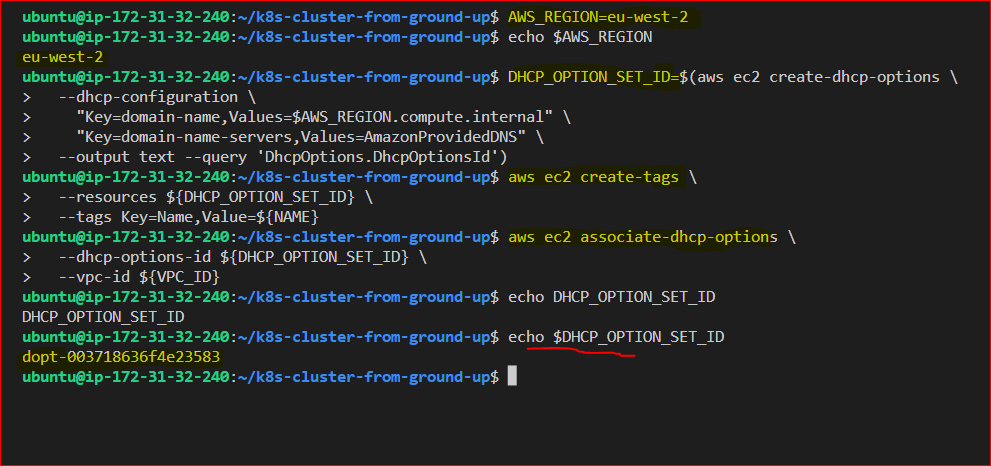
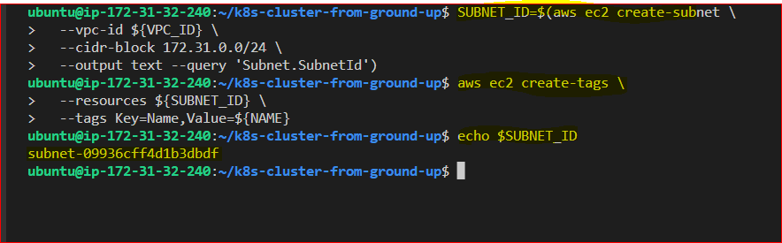
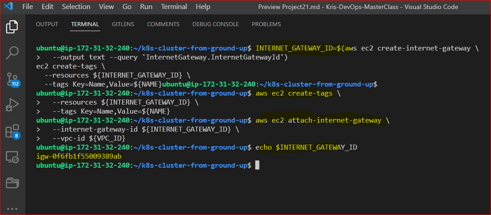
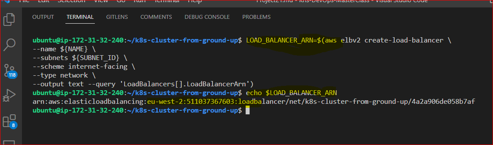

## **ORCHESTRATING CONTAINERS ACROSS MULTIPLE VIRTUAL SERVERS WITH KUBERNETES. PART 1**
---
### **SETTING UP A KUBERNETES CLUSTER FROM GROUND UP (THE HARD WAY)**
---
**Kubernetes Diagram:**


**Project Architectural Diagram:**


K8s installation options

To successfully implement "K8s From-Ground-Up", the following and even more will be done by you as a K8s administrator:

1. Install and configure master (also known as control plane) components and worker nodes (or just nodes).

2. Apply security settings across the entire cluster (i.e., encrypting the data in transit, and at rest)

   - In transit encryption means encrypting communications over the network using HTTPS

   - At rest encryption means encrypting the data stored on a disk

3. Plan the capacity for the backend data store etcd

4. Configure network plugins for the containers to communicate

5. Manage periodical upgrade of the cluster

6. Configure observability and auditing

Note: Unless you have any business or compliance restrictions, ALWAYS consider to use managed versions of **K8s – Platform as a Service** offerings, such as **Azure Kubernetes Service (AKS)**, **Amazon Elastic Kubernetes Service (Amazon EKS)**, or **Google Kubernetes Engine (GKE)** as they usually have better default security settings, and the costs for maintaining the control plane are very low.

Let us begin building out Kubernetes cluster from the ground

DISCLAIMER: The following setup of Kubernetes should be used for learning purpose only, and not to be considered for production. This is because setting up a K8s cluster for production use has a lot more moving parts, especially when it comes to planning the nodes, and securing the cluster. The purpose of "K8s From-Ground-Up" is to get you much closer to the different components as shown in the architecture diagram and relate with what you have been learning about Kubernetes.

Tools to be used and expected result of the Project 20

1. VM: AWS EC2
2. OS: Ubuntu 20.04 lts+
3. Docker Engine
4. kubectl console utility
5. cfssl and cfssljson utilities
6. Kubernetes cluster

You will create 3 EC2 Instances, and in the end, we will have the following parts of the cluster properly configured:

- One Kubernetes Master
- Two Kubernetes Worker Nodes
- Configured SSL/TLS certificates for Kubernetes components to communicate securely
- Configured Node Network
- Configured Pod Network

### **STEP 0-INSTALL CLIENT TOOLS BEFORE BOOTSTRAPPING THE CLUSTER**
---
First, i'll need some client tools installed and configurations made on my client workstation **(AWS Ec2 ubuntu server)**:

- spinup an ec2 ubuntu server to used as my client machine

  

- [awscli](https://docs.aws.amazon.com/cli/latest/userguide/getting-started-install.html#cliv2-linux-install) – is a unified tool to manage your AWS services

- kubectl – this command line utility will be your main control tool to manage your K8s cluster. You will use this tool so many times, so you will be able to type ‘kubetcl’ on your keyboard with a speed of light. You can always make a shortcut (alias) to just one character ‘k’. Also, add this extremely useful official kubectl Cheat Sheet to your bookmarks, it has examples of the most used ‘kubectl’ commands.

- cfssl – an open source toolkit for everything TLS/SSL from Cloudflare

- cfssljson – a program, which takes the JSON output from the cfssl and writes certificates, keys, CSRs, and bundles to disk.

**Install and configure AWS CLI**
---
Configure **AWS CLI** to access all **AWS services** used, for this i need to have a user with **programmatic access keys** configured in AWS Identity and Access Management **(IAM)**:

**NOTE:** AWS CLI has been installed already in my windows local PC from **project 16**

Now, i'll install aws cli and configure programmatic access on my ec2 ubuntu instance 

- To confirm installation: `aws --version`

  

- Configuring access file with the **Access key** and **secret access key**: `aws configure`

  

  **NOTE:** From prj 16, A user with programmatic access keys has already been configured in **AWS IAM**

- Test my AWS CLI to check if i can see **VPC details** by running: `aws ec2 describe-vpcs`

  

### **Installing kubectl on my client machine (ec2 linux server)**
---
Kubernetes cluster has a Web API that can receive HTTP/HTTPS requests, but it is quite cumbersome to curl an API each and every time you need to send some command, so kubectl command tool was developed to ease a K8s administrator’s life.

With this tool you can easily interact with Kubernetes to deploy applications, inspect and manage cluster resources, view logs and perform many more administrative operations.

- Downloading the binary: `wget https://storage.googleapis.com/kubernetes-release/release/v1.21.0/bin/linux/amd64/kubectl`

  **NOTE:** You must use a **kubectl** version that is within one minor version difference of your **cluster**. For example, a **v1.26** client can communicate with **v1.25, v1.26, and v1.27** control planes. Using the latest compatible version of kubectl helps avoid unforeseen issues.

- Making it executable: `chmod +x kubectl`
- Moving the file to the Bin directory: `sudo mv kubectl /usr/local/bin/`
- Verifying that kubectl version 1.21.0 or higher is installed: `kubectl version --client`

  

### **Installing CFSSL And CFSSLJSON**
---
The **cfssl** is an open source tool by Cloudflare used to setup a **Public Key Infrastructure(PKI)** for generating, signing and bundling **TLS certificates**

- Downloading the binary:
```
$ wget -q --show-progress --https-only --timestamping \
  https://storage.googleapis.com/kubernetes-the-hard-way/cfssl/1.4.1/linux/cfssl \
  https://storage.googleapis.com/kubernetes-the-hard-way/cfssl/1.4.1/linux/cfssljson
```  
- Making it executable: `chmod +x cfssl cfssljson`
- Moving the file to the bin directory: `sudo mv cfssl cfssljson /usr/local/bin/`

  

## **AWS CLOUD RESOURCES FOR KUBERNETES CLUSTER**
---
### **Step 1 – Configure Network Infrastructure**

**Virtual Private Cloud – VPC**

1. Create a directory named **k8s-cluster-from-ground-up** and CD into it: `mkdir k8s-cluster-from-ground-up && cd k8s-cluster-from-ground-up`

2. Create a **VPC** and store the ID as a variable:
```
VPC_ID=$(aws ec2 create-vpc \
--cidr-block 172.31.0.0/16 \
--output text --query 'Vpc.VpcId'
)
```
3. Tagging the VPC so that it is named:
```
NAME=k8s-cluster-from-ground-up

aws ec2 create-tags \
  --resources ${VPC_ID} \
  --tags Key=Name,Value=${NAME}
```  
**Domain Name System – DNS**

4. Enable DNS support for your VPC:
```
aws ec2 modify-vpc-attribute \
--vpc-id ${VPC_ID} \
--enable-dns-support '{"Value": true}'
```
5. Enable DNS support for hostnames:
```
aws ec2 modify-vpc-attribute \
--vpc-id ${VPC_ID} \
--enable-dns-hostnames '{"Value": true}'
```


**AWS Region**

6. Set the required region: `AWS_REGION=eu-west-2`

**Dynamic Host Configuration Protocol – DHCP**

7. Configure DHCP Options Set:
```
DHCP_OPTION_SET_ID=$(aws ec2 create-dhcp-options \
  --dhcp-configuration \
    "Key=domain-name,Values=$AWS_REGION.compute.internal" \
    "Key=domain-name-servers,Values=AmazonProvidedDNS" \
  --output text --query 'DhcpOptions.DhcpOptionsId')
  ```
8. Tag the DHCP Option set:
```
aws ec2 create-tags \
  --resources ${DHCP_OPTION_SET_ID} \
  --tags Key=Name,Value=${NAME}
```
9. Associate the DHCP Option set with the VPC:
```
aws ec2 associate-dhcp-options \
  --dhcp-options-id ${DHCP_OPTION_SET_ID} \
  --vpc-id ${VPC_ID}
```



10. Creating the Subnet:
```
 SUBNET_ID=$(aws ec2 create-subnet \
  --vpc-id ${VPC_ID} \
  --cidr-block 172.31.0.0/24 \
  --output text --query 'Subnet.SubnetId')
```
- Tagging the Subnet:
```
 aws ec2 create-tags \
  --resources ${SUBNET_ID} \
  --tags Key=Name,Value=${NAME}
```



**Internet Gateway- IGW**

11. Creating the Internet Gateway and tagging it:
```
INTERNET_GATEWAY_ID=$(aws ec2 create-internet-gateway \
  --output text --query 'InternetGateway.InternetGatewayId')

aws ec2 create-tags \
  --resources ${INTERNET_GATEWAY_ID} \
  --tags Key=Name,Value=${NAME}
```  
- Attaching the internet Gateway to the VPC:
```
aws ec2 attach-internet-gateway \
  --internet-gateway-id ${INTERNET_GATEWAY_ID} \
  --vpc-id ${VPC_ID}
```



**Route tables**

12. Create route tables, associate the route table to subnet, and create a route to allow external traffic to the Internet through the Internet Gateway:
```
ROUTE_TABLE_ID=$(aws ec2 create-route-table \
  --vpc-id ${VPC_ID} \
  --output text --query 'RouteTable.RouteTableId')
aws ec2 create-tags \
  --resources ${ROUTE_TABLE_ID} \
  --tags Key=Name,Value=${NAME}
aws ec2 associate-route-table \
  --route-table-id ${ROUTE_TABLE_ID} \
  --subnet-id ${SUBNET_ID}
aws ec2 create-route \
  --route-table-id ${ROUTE_TABLE_ID} \
  --destination-cidr-block 0.0.0.0/0 \
  --gateway-id ${INTERNET_GATEWAY_ID}
```


### **SECURITY GROUPS**
---
13. Configure security groups
```
# Create the security group and store its ID in a variable
SECURITY_GROUP_ID=$(aws ec2 create-security-group \
  --group-name ${NAME} \
  --description "Kubernetes cluster security group" \
  --vpc-id ${VPC_ID} \
  --output text --query 'GroupId')

# Create the NAME tag for the security group
aws ec2 create-tags \
  --resources ${SECURITY_GROUP_ID} \
  --tags Key=Name,Value=${NAME}

# Create Inbound traffic for all communication within the subnet to connect on ports used by the master node(s)
aws ec2 authorize-security-group-ingress \
    --group-id ${SECURITY_GROUP_ID} \
    --ip-permissions IpProtocol=tcp,FromPort=2379,ToPort=2380,IpRanges='[{CidrIp=172.31.0.0/24}]'

# # Create Inbound traffic for all communication within the subnet to connect on ports used by the worker nodes
aws ec2 authorize-security-group-ingress \
    --group-id ${SECURITY_GROUP_ID} \
    --ip-permissions IpProtocol=tcp,FromPort=30000,ToPort=32767,IpRanges='[{CidrIp=172.31.0.0/24}]'

# Create inbound traffic to allow connections to the Kubernetes API Server listening on port 6443
aws ec2 authorize-security-group-ingress \
  --group-id ${SECURITY_GROUP_ID} \
  --protocol tcp \
  --port 6443 \
  --cidr 0.0.0.0/0

# Create Inbound traffic for SSH from anywhere (Do not do this in production. Limit access ONLY to IPs or CIDR that MUST connect)
aws ec2 authorize-security-group-ingress \
  --group-id ${SECURITY_GROUP_ID} \
  --protocol tcp \
  --port 22 \
  --cidr 0.0.0.0/0

# Create ICMP ingress for all types
aws ec2 authorize-security-group-ingress \
  --group-id ${SECURITY_GROUP_ID} \
  --protocol icmp \
  --port -1 \
  --cidr 0.0.0.0/0
```


### **Network Load Balancer**
---
14. Create a network Load balancer,
```
LOAD_BALANCER_ARN=$(aws elbv2 create-load-balancer \
--name ${NAME} \
--subnets ${SUBNET_ID} \
--scheme internet-facing \
--type network \
--output text --query 'LoadBalancers[].LoadBalancerArn')
```



### **Target Group**
---
15. Create a target group: (For now it will be unhealthy because there are no real targets yet.) 
```
TARGET_GROUP_ARN=$(aws elbv2 create-target-group \
  --name ${NAME} \
  --protocol TCP \
  --port 6443 \
  --vpc-id ${VPC_ID} \
  --target-type ip \
  --output text --query 'TargetGroups[].TargetGroupArn')
```


16. Registering targets - though there are no real targets but the IP addresses are selected so that when the nodes become available they will be used as targets:

```
aws elbv2 register-targets \
  --target-group-arn ${TARGET_GROUP_ARN} \
  --targets Id=172.31.0.1{0,1,2}
```  


17. Creating a listener to listen for requests and forward to the target nodes on TCP port 6443
```
aws elbv2 create-listener \
--load-balancer-arn ${LOAD_BALANCER_ARN} \
--protocol TCP \
--port 6443 \
--default-actions Type=forward,TargetGroupArn=${TARGET_GROUP_ARN} \
--output text --query 'Listeners[].ListenerArn'
```


### **K8s Public Address**
18. Get the Kubernetes Public address
```
KUBERNETES_PUBLIC_ADDRESS=$(aws elbv2 describe-load-balancers \
--load-balancer-arns ${LOAD_BALANCER_ARN} \
--output text --query 'LoadBalancers[].DNSName')
```


### **Step 2 – Create Compute Resources**
---
**AMI**

1. Get an **image** to create **EC2 instances :**
```
IMAGE_ID=$(aws ec2 describe-images --owners 099720109477 \
  --filters \
  'Name=root-device-type,Values=ebs' \
  'Name=architecture,Values=x86_64' \
  'Name=name,Values=ubuntu/images/hvm-ssd/ubuntu-xenial-16.04-amd64-server-*' \
  | jq -r '.Images|sort_by(.Name)[-1]|.ImageId')
```


**SSH key-pair**

2. Create SSH Key-Pair
```
mkdir -p ssh

aws ec2 create-key-pair \
  --key-name ${NAME} \
  --output text --query 'KeyMaterial' \
  > ssh/${NAME}.id_rsa
chmod 600 ssh/${NAME}.id_rsa
```


**EC2 Instances for Controle Plane (Master Nodes)**

3. Create **3 Master nodes:** Note – Using **t2.micro** instead of **t2.small** as **t2.micro** is covered by AWS free tier
```
for i in 0 1 2; do
  instance_id=$(aws ec2 run-instances \
    --associate-public-ip-address \
    --image-id ${IMAGE_ID} \
    --count 1 \
    --key-name ${NAME} \
    --security-group-ids ${SECURITY_GROUP_ID} \
    --instance-type t2.micro \
    --private-ip-address 172.31.0.1${i} \
    --user-data "name=master-${i}" \
    --subnet-id ${SUBNET_ID} \
    --output text --query 'Instances[].InstanceId')
  aws ec2 modify-instance-attribute \
    --instance-id ${instance_id} \
    --no-source-dest-check
  aws ec2 create-tags \
    --resources ${instance_id} \
    --tags "Key=Name,Value=${NAME}-master-${i}"
done
```


### **EC2 Instances for Worker Nodes**
---
Create 3 worker nodes:
```
for i in 0 1 2; do
  instance_id=$(aws ec2 run-instances \
    --associate-public-ip-address \
    --image-id ${IMAGE_ID} \
    --count 1 \
    --key-name ${NAME} \
    --security-group-ids ${SECURITY_GROUP_ID} \
    --instance-type t2.micro \
    --private-ip-address 172.31.0.2${i} \
    --user-data "name=worker-${i}|pod-cidr=172.20.${i}.0/24" \
    --subnet-id ${SUBNET_ID} \
    --output text --query 'Instances[].InstanceId')
  aws ec2 modify-instance-attribute \
    --instance-id ${instance_id} \
    --no-source-dest-check
  aws ec2 create-tags \
    --resources ${instance_id} \
    --tags "Key=Name,Value=${NAME}-worker-${i}"
done
```


### **Step 3: Prepare The Self-Signed Certificate Authority And Generate TLS Certificates**
---
The following **components** running on the **Master node** will require **TLS certificates**.

- kube-controller-manager
- kube-scheduler
- etcd
- kube-apiserver

The following components running on the **Worker nodes** will require **TLS certificates**.

- kubelet
- kube-proxy

Therefore, I will provision a **PKI** Infrastructure using **cfssl** which will have a Certificate Authority which will then generate certificates for all the individual components:

- Creating a directory called **ca-authority** and cd into it: `mkdir ca-authority && cd ca-authority`
- Generating the **CA configuration** file, **Root Certificate**, and **Private key :**
```
{

cat > ca-config.json <<EOF
{
  "signing": {
    "default": {
      "expiry": "8760h"
    },
    "profiles": {
      "kubernetes": {
        "usages": ["signing", "key encipherment", "server auth", "client auth"],
        "expiry": "8760h"
      }
    }
  }
}
EOF

cat > ca-csr.json <<EOF
{
  "CN": "Kubernetes",
  "key": {
    "algo": "rsa",
    "size": 2048
  },
  "names": [
    {
      "C": "UK",
      "L": "England",
      "O": "Kubernetes",
      "OU": "DAREY.IO DEVOPS",
      "ST": "London"
    }
  ]
}
EOF

cfssl gencert -initca ca-csr.json | cfssljson -bare ca

}
```


List the directory to see the created files: `ls -ltr`


The 3 important files here are:

- **ca.pem** – The Root Certificate
- **ca-key.pem** – The Private Key
- **ca.csr** – The Certificate Signing Request

### **Generating TLS Certificates For Client and Server**
---
I will need to provision **Client/Server** certificates for all the components. It is a MUST to have **encrypted** communication within the cluster. Therefore, the **server** here are the **master nodes** running the **api-server** component. While the **client** is every other component that needs to communicate with the **api-server**.

Now we have a certificate for the **Root CA**, we can then begin to request more certificates which the different **Kubernetes components**, i.e. **clients and server**, will use to have encrypted communication.

The **clients** here refer to every other component that will communicate with the **api-server**. These are:

- kube-controller-manager
- kube-scheduler
- etcd
- kubelet
- kube-proxy
- Kubernetes Admin User

### **I'll begin with the Kubernetes API-Server Certificate and Private Key**

The certificate for the **Api-server** must have **IP addresses**, **DNS names**, and a **Load Balancer** address included. Otherwise, you will have a lot of difficulties connecting to the **api-server**.

1. Generate the **Certificate Signing Request (CSR)**, **Private Key** and the **Certificate** for the Kubernetes **Master Nodes (API-Server)**.

```
{
cat > master-kubernetes-csr.json <<EOF
{
  "CN": "kubernetes",
   "hosts": [
   "127.0.0.1",
   "172.31.0.10",
   "172.31.0.11",
   "172.31.0.12",
   "ip-172-31-0-10",
   "ip-172-31-0-11",
   "ip-172-31-0-12",
   "ip-172-31-0-10.${AWS_REGION}.compute.internal",
   "ip-172-31-0-11.${AWS_REGION}.compute.internal",
   "ip-172-31-0-12.${AWS_REGION}.compute.internal",
   "${KUBERNETES_PUBLIC_ADDRESS}",
   "kubernetes",
   "kubernetes.default",
   "kubernetes.default.svc",
   "kubernetes.default.svc.cluster",
   "kubernetes.default.svc.cluster.local"
  ],
  "key": {
    "algo": "rsa",
    "size": 2048
  },
  "names": [
    {
      "C": "UK",
      "L": "England",
      "O": "kubernetes",
      "OU": "DAREY.IO DEVOPS",
      "ST": "London"
    }
  ]
}
EOF

cfssl gencert \
  -ca=ca.pem \
  -ca-key=ca-key.pem \
  -config=ca-config.json \
  -profile=kubernetes \
  master-kubernetes-csr.json | cfssljson -bare master-kubernetes
}
```


**Creating the other certificates: for the following Kubernetes components:**

- Scheduler Client Certificate
- Kube Proxy Client Certificate
- Controller Manager Client Certificate
- Kubelet Client Certificates
- K8s admin user Client Certificate

2. **kube-scheduler** Client Certificate and Private Key
```
{

cat > kube-scheduler-csr.json <<EOF
{
  "CN": "system:kube-scheduler",
  "key": {
    "algo": "rsa",
    "size": 2048
  },
  "names": [
    {
      "C": "UK",
      "L": "England",
      "O": "system:kube-scheduler",
      "OU": "DAREY.IO DEVOPS",
      "ST": "London"
    }
  ]
}
EOF

cfssl gencert \
  -ca=ca.pem \
  -ca-key=ca-key.pem \
  -config=ca-config.json \
  -profile=kubernetes \
  kube-scheduler-csr.json | cfssljson -bare kube-scheduler

}
```


3. **kube-proxy** Client Certificate and Private Key

```
{

cat > kube-proxy-csr.json <<EOF
{
  "CN": "system:kube-proxy",
  "key": {
    "algo": "rsa",
    "size": 2048
  },
  "names": [
    {
      "C": "UK",
      "L": "England",
      "O": "system:node-proxier",
      "OU": "DAREY.IO DEVOPS",
      "ST": "London"
    }
  ]
}
EOF

cfssl gencert \
  -ca=ca.pem \
  -ca-key=ca-key.pem \
  -config=ca-config.json \
  -profile=kubernetes \
  kube-proxy-csr.json | cfssljson -bare kube-proxy

}
```


4. **kube-controller-manager** Client Certificate and Private Key
```
{
cat > kube-controller-manager-csr.json <<EOF
{
  "CN": "system:kube-controller-manager",
  "key": {
    "algo": "rsa",
    "size": 2048
  },
  "names": [
    {
      "C": "UK",
      "L": "England",
      "O": "system:kube-controller-manager",
      "OU": "DAREY.IO DEVOPS",
      "ST": "London"
    }
  ]
}
EOF

cfssl gencert \
  -ca=ca.pem \
  -ca-key=ca-key.pem \
  -config=ca-config.json \
  -profile=kubernetes \
  kube-controller-manager-csr.json | cfssljson -bare kube-controller-manager

}
```


5. **kubelet** Client Certificate and Private Key

Similar to how i configured the **api-server's** certificate, Kubernetes requires that the **hostname** of each **worker node** is included in the **client certificate**.

Also, Kubernetes uses a special-purpose authorization mode called **Node Authorizer**, that specifically authorizes **API** requests made by **kubelet** services. In order to be authorized by the Node Authorizer, kubelets must use a credential that identifies them as being in the system:nodes **group**, with a username of system:node:**(nodeName)**. Notice the **"CN"**: "system:node:${instance_hostname}", in the below code.

Therefore, the certificate to be created must comply to these requirements. In the below example, there are 3 worker nodes, hence we will use bash to loop through a list of the worker nodes’ hostnames, and based on each index, the respective Certificate Signing Request (CSR), private key and client certificates will be generated.
```
for i in 0 1 2; do
  instance="${NAME}-worker-${i}"
  instance_hostname="ip-172-31-0-2${i}"
  cat > ${instance}-csr.json <<EOF
{
  "CN": "system:node:${instance_hostname}",
  "key": {
    "algo": "rsa",
    "size": 2048
  },
  "names": [
    {
      "C": "UK",
      "L": "England",
      "O": "system:nodes",
      "OU": "DAREY.IO DEVOPS",
      "ST": "London"
    }
  ]
}
EOF

  external_ip=$(aws ec2 describe-instances \
    --filters "Name=tag:Name,Values=${instance}" \
    --output text --query 'Reservations[].Instances[].PublicIpAddress')

  internal_ip=$(aws ec2 describe-instances \
    --filters "Name=tag:Name,Values=${instance}" \
    --output text --query 'Reservations[].Instances[].PrivateIpAddress')

  cfssl gencert \
    -ca=ca.pem \
    -ca-key=ca-key.pem \
    -config=ca-config.json \
    -hostname=${instance_hostname},${external_ip},${internal_ip} \
    -profile=kubernetes \
    ${NAME}-worker-${i}-csr.json | cfssljson -bare ${NAME}-worker-${i}
done
```


6. **kubernetes admin user's** Client Certificate and Private Key
```
{
cat > admin-csr.json <<EOF
{
  "CN": "admin",
  "key": {
    "algo": "rsa",
    "size": 2048
  },
  "names": [
    {
      "C": "UK",
      "L": "England",
      "O": "system:masters",
      "OU": "DAREY.IO DEVOPS",
      "ST": "London"
    }
  ]
}
EOF

cfssl gencert \
  -ca=ca.pem \
  -ca-key=ca-key.pem \
  -config=ca-config.json \
  -profile=kubernetes \
  admin-csr.json | cfssljson -bare admin
}
```


7. Generating Client Certificate and Private Key for **Token Controller**

It is a part of the Kubernetes Controller Manager responsible for generating and signing service account tokens which are used by pods or other resources to establish connectivity to the api-server
```
{

cat > service-account-csr.json <<EOF
{
  "CN": "service-accounts",
  "key": {
    "algo": "rsa",
    "size": 2048
  },
  "names": [
    {
      "C": "UK",
      "L": "England",
      "O": "Kubernetes",
      "OU": "DAREY.IO DEVOPS",
      "ST": "London"
    }
  ]
}
EOF

cfssl gencert \
  -ca=ca.pem \
  -ca-key=ca-key.pem \
  -config=ca-config.json \
  -profile=kubernetes \
  service-account-csr.json | cfssljson -bare service-account
}
```


### **Step 4 – Distributing the Client and Server Certificates**
---
Now it is time to start sending all the **client** and **server** certificates to their respective instances.

Let us begin with the **worker nodes:**

Copy these files securely to the worker nodes using **scp** utility
- Root CA certificate – ca.pem
-  X509 Certificate for each worker node
- Private Key of the certificate for each worker node
```
for i in 0 1 2; do
  instance="${NAME}-worker-${i}"
  external_ip=$(aws ec2 describe-instances \
    --filters "Name=tag:Name,Values=${instance}" \
    --output text --query 'Reservations[].Instances[].PublicIpAddress')
  scp -i ../ssh/${NAME}.id_rsa \
    ca.pem ${instance}-key.pem ${instance}.pem ubuntu@${external_ip}:~/; \
done
```


**Master or Controller node: –** Note that only the api-server related files will be sent over to the master nodes.
```
for i in 0 1 2; do
instance="${NAME}-master-${i}" \
  external_ip=$(aws ec2 describe-instances \
    --filters "Name=tag:Name,Values=${instance}" \
    --output text --query 'Reservations[].Instances[].PublicIpAddress')
  scp -i ../ssh/${NAME}.id_rsa \
    ca.pem ca-key.pem service-account-key.pem service-account.pem \
    master-kubernetes.pem master-kubernetes-key.pem ubuntu@${external_ip}:~/;
done
```


### **STEP 5 USE 'KUBECTL' TO GENERATE KUBERNETES CONFIGURATION FILES FOR AUTHENTICATION**
---
All i have been doing so far is ensuring that i do not face any difficulties by the time the Kubernetes cluster is up and running. In this step, i will create some files known as **kubeconfig**, which enables **Kubernetes clients** to locate and authenticate to the **Kubernetes API Servers**.

I will need a client tool called **kubectl** to do this.

Now it’s time to generate **kubeconfig** files for the **kubelet**, **controller manager**, **kube-proxy**, and **scheduler** clients and then the **admin user**.

First, I'll create a few **environment variables** for reuse by multiple commands.

`KUBERNETES_API_SERVER_ADDRESS=$(aws elbv2 describe-load-balancers --load-balancer-arns ${LOAD_BALANCER_ARN} --output text --query 'LoadBalancers[].DNSName')`

1. Generate the **kubelet** kubeconfig file

For each of the **nodes** running the **kubelet component**, it is very important that the **client certificate** configured for that node is used to generate the **kubeconfig**. This is because each certificate has the node’s DNS name or IP Address configured at the time the certificate was generated. It will also ensure that the appropriate authorization is applied to that node through the **Node Authorizer**

Below command must be run in the directory where all the certificates were generated.
```
for i in 0 1 2; do

instance="${NAME}-worker-${i}"
instance_hostname="ip-172-31-0-2${i}"

 # Set the kubernetes cluster in the kubeconfig file
  kubectl config set-cluster ${NAME} \
    --certificate-authority=ca.pem \
    --embed-certs=true \
    --server=https://$KUBERNETES_API_SERVER_ADDRESS:6443 \
    --kubeconfig=${instance}.kubeconfig

# Set the cluster credentials in the kubeconfig file
  kubectl config set-credentials system:node:${instance_hostname} \
    --client-certificate=${instance}.pem \
    --client-key=${instance}-key.pem \
    --embed-certs=true \
    --kubeconfig=${instance}.kubeconfig

# Set the context in the kubeconfig file
  kubectl config set-context default \
    --cluster=${NAME} \
    --user=system:node:${instance_hostname} \
    --kubeconfig=${instance}.kubeconfig

  kubectl config use-context default --kubeconfig=${instance}.kubeconfig
done
```
Afterwards, list the output: `ls -ltr *.kubeconfig`


2. Generate the **kube-proxy** kubeconfig
```
{
  kubectl config set-cluster ${NAME} \
    --certificate-authority=ca.pem \
    --embed-certs=true \
    --server=https://${KUBERNETES_API_SERVER_ADDRESS}:6443 \
    --kubeconfig=kube-proxy.kubeconfig

  kubectl config set-credentials system:kube-proxy \
    --client-certificate=kube-proxy.pem \
    --client-key=kube-proxy-key.pem \
    --embed-certs=true \
    --kubeconfig=kube-proxy.kubeconfig

  kubectl config set-context default \
    --cluster=${NAME} \
    --user=system:kube-proxy \
    --kubeconfig=kube-proxy.kubeconfig

  kubectl config use-context default --kubeconfig=kube-proxy.kubeconfig
}
```


3. Generate the **Kube-Controller-Manager** kubeconfig

Notice that the **--server** is set to use **127.0.0.1**. This is because, this component runs on the **API-Server** so there is no point routing through the **Load Balancer**.
```
{
  kubectl config set-cluster ${NAME} \
    --certificate-authority=ca.pem \
    --embed-certs=true \
    --server=https://127.0.0.1:6443 \
    --kubeconfig=kube-controller-manager.kubeconfig

  kubectl config set-credentials system:kube-controller-manager \
    --client-certificate=kube-controller-manager.pem \
    --client-key=kube-controller-manager-key.pem \
    --embed-certs=true \
    --kubeconfig=kube-controller-manager.kubeconfig

  kubectl config set-context default \
    --cluster=${NAME} \
    --user=system:kube-controller-manager \
    --kubeconfig=kube-controller-manager.kubeconfig

  kubectl config use-context default --kubeconfig=kube-controller-manager.kubeconfig
}
```


4. Generating the **Kube-Scheduler** Kubeconfig
```
{
  kubectl config set-cluster ${NAME} \
    --certificate-authority=ca.pem \
    --embed-certs=true \
    --server=https://127.0.0.1:6443 \
    --kubeconfig=kube-scheduler.kubeconfig

  kubectl config set-credentials system:kube-scheduler \
    --client-certificate=kube-scheduler.pem \
    --client-key=kube-scheduler-key.pem \
    --embed-certs=true \
    --kubeconfig=kube-scheduler.kubeconfig

  kubectl config set-context default \
    --cluster=${NAME} \
    --user=system:kube-scheduler \
    --kubeconfig=kube-scheduler.kubeconfig

  kubectl config use-context default --kubeconfig=kube-scheduler.kubeconfig
}
```


5. Finally, generate the kubeconfig file for the **admin user**
```
{
  kubectl config set-cluster ${NAME} \
    --certificate-authority=ca.pem \
    --embed-certs=true \
    --server=https://${KUBERNETES_API_SERVER_ADDRESS}:6443 \
    --kubeconfig=admin.kubeconfig

  kubectl config set-credentials admin \
    --client-certificate=admin.pem \
    --client-key=admin-key.pem \
    --embed-certs=true \
    --kubeconfig=admin.kubeconfig

  kubectl config set-context default \
    --cluster=${NAME} \
    --user=admin \
    --kubeconfig=admin.kubeconfig

  kubectl config use-context default --kubeconfig=admin.kubeconfig
}
```


**TASK:**

 Distribute the files to their respective servers, using scp and a for loop like we have done previously.

**For Master Nodes:** 

I'll distribute the **master nodes** component kubeconfig files **(kube-scheduler,kube-controller-manager, admin)** to the 3 master nodes server, using **scp** and **for loop**
```
for i in 0 1 2; do
instance="${NAME}-master-${i}" \
  external_ip=$(aws ec2 describe-instances \
    --filters "Name=tag:Name,Values=${instance}" \
    --output text --query 'Reservations[].Instances[].PublicIpAddress')
  scp -i ../ssh/${NAME}.id_rsa \
    admin.kubeconfig kube-scheduler.kubeconfig kube-controller-manager.kubeconfig ubuntu@${external_ip}:~/;
done
```


**For Worker Nodes:** 
```
for i in 0 1 2; do
  instance="${NAME}-worker-${i}"
  external_ip=$(aws ec2 describe-instances \
    --filters "Name=tag:Name,Values=${instance}" \
    --output text --query 'Reservations[].Instances[].PublicIpAddress')
  scp -i ../ssh/${NAME}.id_rsa \
    kube-proxy.kubeconfig ${instance}.kubeconfig ubuntu@${external_ip}:~/; \
done
```


### **Step 6 Prepare the etcd database for encryption at rest.**
---
Kubernetes uses **etcd** (A distributed key value store) to store variety of data which includes the cluster state, application configurations, and secrets but since the data in it is stored as plain text, therefore the etcd is encrypted as follows,

- Generating encryption key and encoding it using base64:`ETCD_ENCRYPTION_KEY=$(head -c 32 /dev/urandom | base64)`
- Creating an encryption-config.yaml file
```
cat > encryption-config.yaml <<EOF
kind: EncryptionConfig
apiVersion: v1
resources:
 - resources:
     - secrets
   providers:
     - aescbc:
         keys:
           - name: key1
             secret: ${ETCD_ENCRYPTION_KEY}
     - identity: {}
EOF
```


- Sending the **encryption-config.yaml** file to the **master nodes** using **scp** and a **for loop**
```
for i in 0 1 2; do
instance="${NAME}-master-${i}" \
  external_ip=$(aws ec2 describe-instances \
    --filters "Name=tag:Name,Values=${instance}" \
    --output text --query 'Reservations[].Instances[].PublicIpAddress')
  scp -i ../ssh/${NAME}.id_rsa \
    encryption-config.yaml ubuntu@${external_ip}:~/;
done
```


- Bootstrapping etcd cluster using [tmux](https://phoenixnap.com/kb/tmux-tutorial-install-commands) to work with multiple terminal sessions simultaneously. Opening 3 panes and ssh into the 3 master nodes and setting the synchronize-panes on

**NOTE:** I install **tmux** on my ubuntu server **(Prj-21-linux-sever)** 

1. SSH into the controller server

For Master node 1
```
master_1_ip=$(aws ec2 describe-instances \
--filters "Name=tag:Name,Values=${NAME}-master-0" \
--output text --query 'Reservations[].Instances[].PublicIpAddress')
ssh -i k8s-cluster-from-ground-up.id_rsa ubuntu@${master_1_ip}
```


For Master node 2
```
master_2_ip=$(aws ec2 describe-instances \
--filters "Name=tag:Name,Values=${NAME}-master-1" \
--output text --query 'Reservations[].Instances[].PublicIpAddress')
ssh -i k8s-cluster-from-ground-up.id_rsa ubuntu@${master_2_ip}
```


For Master node 3
```
master_3_ip=$(aws ec2 describe-instances \
--filters "Name=tag:Name,Values=${NAME}-master-2" \
--output text --query 'Reservations[].Instances[].PublicIpAddress')
ssh -i k8s-cluster-from-ground-up.id_rsa ubuntu@${master_3_ip}
```


2. Download and install **etcd**
```
  wget -q --show-progress --https-only --timestamping \
  "https://github.com/etcd-io/etcd/releases/download/v3.4.15/etcd-v3.4.15-linux-amd64.tar.gz"
```
3. Extract and install the **etcd** server and the etcdctl command line utility 
```
{
tar -xvf etcd-v3.4.15-linux-amd64.tar.gz
sudo mv etcd-v3.4.15-linux-amd64/etcd* /usr/local/bin/
}
```


 4. Configure the **etcd** server
 ```
 {
  sudo mkdir -p /etc/etcd /var/lib/etcd
  sudo chmod 700 /var/lib/etcd
  sudo cp ca.pem master-kubernetes-key.pem master-kubernetes.pem /etc/etcd/
}
```


5. The instance internal IP address will be used to serve client requests and communicate with etcd cluster peers. Retrieve the internal IP address for the current compute instance:

   `export INTERNAL_IP=$(curl -s http://169.254.169.254/latest/meta-data/local-ipv4)`

6. Each **etcd** member must have a unique name within an **etcd** cluster. Set the etcd name to node Private IP address so it will uniquely identify the machine:   
```
ETCD_NAME=$(curl -s http://169.254.169.254/latest/user-data/ \
  | tr "|" "\n" | grep "^name" | cut -d"=" -f2)

echo ${ETCD_NAME}
```


7. Create the **etcd.service** systemd unit file:

   The flags are well documented [here](https://www.bookstack.cn/read/etcd-3.2.17-en/717bafd59fa87192.md)

```
cat <<EOF | sudo tee /etc/systemd/system/etcd.service
[Unit]
Description=etcd
Documentation=https://github.com/coreos

[Service]
Type=notify
ExecStart=/usr/local/bin/etcd \\
  --name ${ETCD_NAME} \\
  --trusted-ca-file=/etc/etcd/ca.pem \\
  --peer-trusted-ca-file=/etc/etcd/ca.pem \\
  --peer-client-cert-auth \\
  --client-cert-auth \\
  --listen-peer-urls https://${INTERNAL_IP}:2380 \\
  --listen-client-urls https://${INTERNAL_IP}:2379,https://127.0.0.1:2379 \\
  --advertise-client-urls https://${INTERNAL_IP}:2379 \\
  --initial-cluster-token etcd-cluster-0 \\
  --initial-cluster master-0=https://172.31.0.10:2380,master-1=https://172.31.0.11:2380,master-2=https://172.31.0.12:2380 \\
  --cert-file=/etc/etcd/master-kubernetes.pem \\
  --key-file=/etc/etcd/master-kubernetes-key.pem \\
  --peer-cert-file=/etc/etcd/master-kubernetes.pem \\
  --peer-key-file=/etc/etcd/master-kubernetes-key.pem \\
  --initial-advertise-peer-urls https://${INTERNAL_IP}:2380 \\
  --initial-cluster-state new \\
  --data-dir=/var/lib/etcd
Restart=on-failure
RestartSec=5

[Install]
WantedBy=multi-user.target
EOF
```


8. Start and enable the **etcd** Server 
```
{
sudo systemctl daemon-reload
sudo systemctl enable etcd
sudo systemctl start etcd
}
```


9. Verify the **etcd** installation
```
sudo ETCDCTL_API=3 etcdctl member list \
  --endpoints=https://127.0.0.1:2379 \
  --cacert=/etc/etcd/ca.pem \
  --cert=/etc/etcd/master-kubernetes.pem \
  --key=/etc/etcd/master-kubernetes-key.pem
```


Checking the etcd service status: `systemctl status etcd`


### **BOOTSTRAP THE CONTROL PLANE**
---
In this section, i will configure the components for the control plane on the master/controller nodes.

1. Create the Kubernetes configuration directory: `sudo mkdir -p /etc/kubernetes/config`
2. Download the official Kubernetes release binaries:
```
wget -q --show-progress --https-only --timestamping \
"https://storage.googleapis.com/kubernetes-release/release/v1.21.0/bin/linux/amd64/kube-apiserver" \
"https://storage.googleapis.com/kubernetes-release/release/v1.21.0/bin/linux/amd64/kube-controller-manager" \
"https://storage.googleapis.com/kubernetes-release/release/v1.21.0/bin/linux/amd64/kube-scheduler" \
"https://storage.googleapis.com/kubernetes-release/release/v1.21.0/bin/linux/amd64/kubectl"
```


3. Install the Kubernetes binaries:
```
{
chmod +x kube-apiserver kube-controller-manager kube-scheduler kubectl
sudo mv kube-apiserver kube-controller-manager kube-scheduler kubectl /usr/local/bin/
}
```
4. Configure the Kubernetes API Server:
```
{
sudo mkdir -p /var/lib/kubernetes/

sudo mv ca.pem ca-key.pem master-kubernetes-key.pem master-kubernetes.pem \
service-account-key.pem service-account.pem \
encryption-config.yaml /var/lib/kubernetes/
}
```


The instance internal IP address will be used to advertise the API Server to members of the cluster. Retrieve the internal IP address for the current compute instance:

`export INTERNAL_IP=$(curl -s http://169.254.169.254/latest/meta-data/local-ipv4)`

- Create the **kube-apiserver.service** systemd unit file: See startup flag used in below systemd file from the documentation [here](https://kubernetes.io/docs/reference/command-line-tools-reference/kube-apiserver/)

```
cat <<EOF | sudo tee /etc/systemd/system/kube-apiserver.service
[Unit]
Description=Kubernetes API Server
Documentation=https://github.com/kubernetes/kubernetes

[Service]
ExecStart=/usr/local/bin/kube-apiserver \\
  --advertise-address=${INTERNAL_IP} \\
  --allow-privileged=true \\
  --apiserver-count=3 \\
  --audit-log-maxage=30 \\
  --audit-log-maxbackup=3 \\
  --audit-log-maxsize=100 \\
  --audit-log-path=/var/log/audit.log \\
  --authorization-mode=Node,RBAC \\
  --bind-address=0.0.0.0 \\
  --client-ca-file=/var/lib/kubernetes/ca.pem \\
  --enable-admission-plugins=NamespaceLifecycle,NodeRestriction,LimitRanger,ServiceAccount,DefaultStorageClass,ResourceQuota \\
  --etcd-cafile=/var/lib/kubernetes/ca.pem \\
  --etcd-certfile=/var/lib/kubernetes/master-kubernetes.pem \\
  --etcd-keyfile=/var/lib/kubernetes/master-kubernetes-key.pem\\
  --etcd-servers=https://172.31.0.10:2379,https://172.31.0.11:2379,https://172.31.0.12:2379 \\
  --event-ttl=1h \\
  --encryption-provider-config=/var/lib/kubernetes/encryption-config.yaml \\
  --kubelet-certificate-authority=/var/lib/kubernetes/ca.pem \\
  --kubelet-client-certificate=/var/lib/kubernetes/master-kubernetes.pem \\
  --kubelet-client-key=/var/lib/kubernetes/master-kubernetes-key.pem \\
  --runtime-config='api/all=true' \\
  --service-account-key-file=/var/lib/kubernetes/service-account.pem \\
  --service-account-signing-key-file=/var/lib/kubernetes/service-account-key.pem \\
  --service-account-issuer=https://${INTERNAL_IP}:6443 \\
  --service-cluster-ip-range=172.32.0.0/24 \\
  --service-node-port-range=30000-32767 \\
  --tls-cert-file=/var/lib/kubernetes/master-kubernetes.pem \\
  --tls-private-key-file=/var/lib/kubernetes/master-kubernetes-key.pem \\
  --v=2
Restart=on-failure
RestartSec=5

[Install]
WantedBy=multi-user.target
EOF
```


5. Configure the Kubernetes Controller Manager:

- Move the kube-controller-manager kubeconfig into place: `sudo mv kube-controller-manager.kubeconfig /var/lib/kubernetes/`

Export some variables to retrieve the **vpc_cidr** – This will be required for the **bind-address** flag:
```
export AWS_METADATA="http://169.254.169.254/latest/meta-data"
export EC2_MAC_ADDRESS=$(curl -s $AWS_METADATA/network/interfaces/macs/ | head -n1 | tr -d '/')
export VPC_CIDR=$(curl -s $AWS_METADATA/network/interfaces/macs/$EC2_MAC_ADDRESS/vpc-ipv4-cidr-block/)
export NAME=k8s-cluster-from-ground-up
```


- Create the kube-controller-manager.service systemd unit file:
```
cat <<EOF | sudo tee /etc/systemd/system/kube-controller-manager.service
[Unit]
Description=Kubernetes Controller Manager
Documentation=https://github.com/kubernetes/kubernetes

[Service]
ExecStart=/usr/local/bin/kube-controller-manager \\
  --bind-address=0.0.0.0 \\
  --cluster-cidr=${VPC_CIDR} \\
  --cluster-name=${NAME} \\
  --cluster-signing-cert-file=/var/lib/kubernetes/ca.pem \\
  --cluster-signing-key-file=/var/lib/kubernetes/ca-key.pem \\
  --kubeconfig=/var/lib/kubernetes/kube-controller-manager.kubeconfig \\
  --authentication-kubeconfig=/var/lib/kubernetes/kube-controller-manager.kubeconfig \\
  --authorization-kubeconfig=/var/lib/kubernetes/kube-controller-manager.kubeconfig \\
  --leader-elect=true \\
  --root-ca-file=/var/lib/kubernetes/ca.pem \\
  --service-account-private-key-file=/var/lib/kubernetes/service-account-key.pem \\
  --service-cluster-ip-range=172.32.0.0/24 \\
  --use-service-account-credentials=true \\
  --v=2
Restart=on-failure
RestartSec=5

[Install]
WantedBy=multi-user.target
EOF
```


6. Configure the Kubernetes Scheduler:

- Move the kube-scheduler kubeconfig into place:
```
sudo mv kube-scheduler.kubeconfig /var/lib/kubernetes/
sudo mkdir -p /etc/kubernetes/config
```
- Create the kube-scheduler.yaml configuration file:
```
cat <<EOF | sudo tee /etc/kubernetes/config/kube-scheduler.yaml
apiVersion: kubescheduler.config.k8s.io/v1beta1
kind: KubeSchedulerConfiguration
clientConnection:
  kubeconfig: "/var/lib/kubernetes/kube-scheduler.kubeconfig"
leaderElection:
  leaderElect: true
EOF
```


- Create the kube-scheduler.service systemd unit file:
```
cat <<EOF | sudo tee /etc/systemd/system/kube-scheduler.service
[Unit]
Description=Kubernetes Scheduler
Documentation=https://github.com/kubernetes/kubernetes

[Service]
ExecStart=/usr/local/bin/kube-scheduler \\
  --config=/etc/kubernetes/config/kube-scheduler.yaml \\
  --v=2
Restart=on-failure
RestartSec=5

[Install]
WantedBy=multi-user.target
EOF
```


7. Start the Controller Services
```
{
sudo systemctl daemon-reload
sudo systemctl enable kube-apiserver kube-controller-manager kube-scheduler
sudo systemctl start kube-apiserver kube-controller-manager kube-scheduler
}
```


- Check the status of the services. Start with the **kube-scheduler** and **kube-controller-manager**. It may take up to 20 seconds for **kube-apiserver** to be fully loaded.
```
{
sudo systemctl status kube-apiserver
sudo systemctl status kube-controller-manager
sudo systemctl status kube-scheduler
}
```


### **Testing that Everything is working fine**
---
1. To get the cluster details run: `kubectl cluster-info  --kubeconfig admin.kubeconfig`

2. To get the current namespaces: `kubectl get namespaces --kubeconfig admin.kubeconfig`

3. To reach the Kubernetes API Server publicly: `curl --cacert /var/lib/kubernetes/ca.pem https://$INTERNAL_IP:6443/version`

4. To get the status of each component: `kubectl get componentstatuses --kubeconfig admin.kubeconfig`


