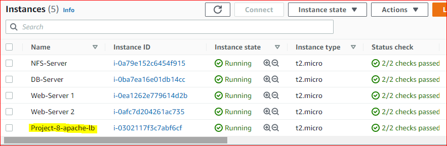

## LOAD BALANCER SOLUTION WITH APACHE
---
In this project I will enhance my **Tooling Website solution** Created in Project 7 by adding a **Load Balancer** to distribute traffic between **Web Servers** and allow users to access my website using a single URL

Task
=
Deploy and configure an **Apache Load Balancer** for Tooling Website solution on a separate Ubuntu EC2 intance. Make sure that users can be served by Web servers through the Load Balancer.

Note: 
---
The following servers has been installed and configured within Project-7 (https://github.com/Amae69/devops-pbl/blob/7685167ebd479201f1598b3217f816479ff03c9e/Project7.md):

1. Two RHEL8 **Web Servers**
2. One MySQL **DB Server** (based on Ubuntu 20.04)
3. One RHEL8 **NFS server**



### Configure Apache As A Load Balancer
---
- I'll create an Ubuntu Server 20.04 EC2 instance and name it **Project-8-apache-lb**

- I'll Open TCP port 80 on **Project-8-apache-lb** by creating an Inbound Rule in Security Group.

- Install **Apache Load Balancer** on **Project-8-apache-lb server** and configure it to point traffic coming to LB to both Web Servers:

      #Install apache2
      sudo apt update
      sudo apt install apache2 -y
      sudo apt-get install libxml2-dev

      #Enable following modules:
      sudo a2enmod rewrite
      sudo a2enmod proxy
      sudo a2enmod proxy_balancer
      sudo a2enmod proxy_http
      sudo a2enmod headers
      sudo a2enmod lbmethod_bytraffic

      #Restart apache2 service
      sudo systemctl restart apache2

- **Make sure apache2 is up and running**

  `sudo systemctl status apache2`

   

- **Configure load balancing** 
   ```
  sudo vi /etc/apache2/sites-available/000-default.conf


  #Add this configuration into this section <VirtualHost *:80>  </VirtualHost>

  <Proxy "balancer://mycluster">
               BalancerMember http://<WebServer1-Private-IP-Address>:80 loadfactor=5 timeout=1
               BalancerMember http://<WebServer2-Private-IP-Address>:80 loadfactor=5 timeout=1
               ProxySet lbmethod=bytraffic
               # ProxySet lbmethod=byrequests
        </Proxy>

        ProxyPreserveHost On
        ProxyPass / balancer://mycluster/
        ProxyPassReverse / balancer://mycluster/


- **Restart apache server**

  `sudo systemctl restart apache2`

- To verify that my configuration works, i'll try to access my LB’s public IP address or Public DNS name from my browser:

  `http://<Load-Balancer-Public-IP-Address-or-Public-DNS-Name>/index.php` 

  `http://http://13.40.226.47/index.php`

  

### **End of Project...**  
  

