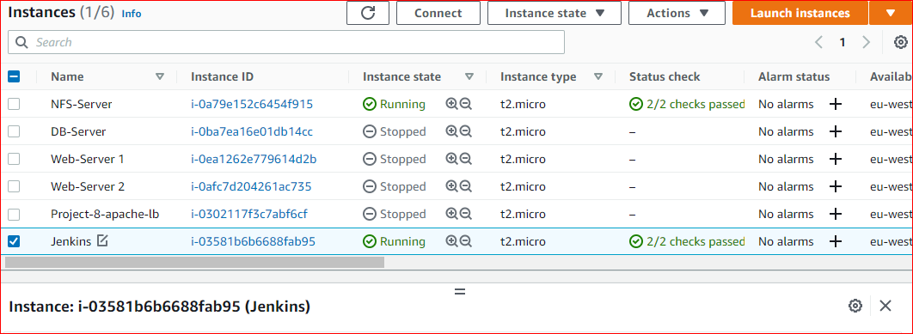

## Continous Integration Pipeline For Tooling Website
---
**Task**

I'll enhance the architecture prepared in **Project 8** (https://github.com/Amae69/devops-pbl/blob/d41ce9abb64ab44f07c89c07781261243e6821b3/Project8.md) by adding a **Jenkins server**, 

I'll configure a job to automatically deploy source codes changes from **Git** to **NFS server**.

**Project Architecture:**

 

### **Step 1 – Install Jenkins server**
---
- I create an AWS EC2 server based on **Ubuntu Server 20.04 LTS** and name it **"Jenkins"**

  

- Install **JDK**

  `sudo apt update`

  `sudo apt install default-jdk-headless`

- Install Jenkins 
  ```
  wget -q -O - https://pkg.jenkins.io/debian-stable/jenkins.io.key | sudo apt-key add -
  sudo sh -c 'echo deb https://pkg.jenkins.io/debian-stable binary/ > \
    /etc/apt/sources.list.d/jenkins.list'
  
  sudo apt update

  sudo apt-get install jenkins
  ```
- Check if Jenkins is up and running

  `sudo systemctl status jenkins`

   

- By default **Jenkins** server uses TCP port **8080** – I opened it by creating a new Inbound Rule in my EC2 Security Group

   

- I'll Perform the initial **Jenkins** setup.
  ```
  From my browser i'll access:
  
  http://<Jenkins-Server-Public-IP-Address-or-Public-DNS-Name>:8080   
  ```
- Retrieve my default admin password and Login to Jekins server:

  `sudo cat /var/lib/jenkins/secrets/initialAdminPassword`  

  

- To get started i will select to install **suggested plugins** 
  
  
  

- Once plugins installation is done, i'll create an admin user and i'll will get my Jenkins server address

  

### **Step 2 – Configure Jenkins to retrieve source codes from GitHub using Webhooks**
---

In this step, i'll configure a simple Jenkins job/project. 

This job will be triggered by **GitHub webhooks** and will execute a **‘build’** task to retrieve codes from **GitHub** and store it locally on **Jenkins server**. 

- I'll enable webhooks in my GitHub repository.

  Go to my GitHub: Settings > Webhooks > Add webhooks > Jenkins server URL (http://3.8.194.172:8080/github-webhook/)

  

- I'll go to Jenkins web console on my browser, click **"New Item"** and create a **"Freestyle project"**

- To connect my GitHub repository, i will need to provide its URL, 

  

- In configuration of my Jenkins **freestyle project**, I'll choose Git repository, then provide the link to my **Tooling** GitHub repository and credentials (user/password) so Jenkins could access files in the repository. 

  

- I'll apply and Save the configuration made above, then i'll try to run the **build** manually first by
Clicking **"Build Now"** button, if everything is configured correctly, the build will be successfull and i will see it under **#1**, **console output**  

  

- Now i'll configured an **automated** Jenkins job that receives files from **GitHub** by **webhook trigger**

  1. i'll configure build triggers to trigger the job from GitHub webhook.

     

  2. I'll Configure **"Post-build Actions"** to archive all the files – files resulted from a build are called **"artifacts"**

     Add Post-build Actions > Archive the artifacts > Files to archive. input "**" to indicate **"all"**

     

  3. I'll go ahead and make some change in any file in my GitHub repository (e.g. README.MD file) commit and save the changes to the master branch.

  4. I'll confirmed that a new build has been launched automatically **(by webhook)**

     

  By default, the artifacts are stored on Jenkins server locally

  `ls /var/lib/jenkins/jobs/tooling_github/builds/<build_number>/archive/`

### **Step 3 – Configure Jenkins to copy files to NFS server via SSH**     

Now i have my artifacts saved locally on **Jenkins server**, the next step is to copy them to my **NFS server** to **/mnt/apps** directory to achieve this, i'll install this plugins **"Publish over ssh"**.

1. Install **"Publish Over SSH"** plugin.

   On main dashboard i'll select **"Manage Jenkins"** > **"Manage Plugins"** > **"Available"** tab then search for **"Publish Over SSH"** plugin and install it

   

2. Configure the **job/project** to copy **artifacts** over to **NFS server**.

   On main dashboard i'll select **"Manage Jenkins"**>**"Configure System"**>Scroll down to **Publish over SSH** plugin configuration section and configure it to be able to connect to my **NFS server:**

    i. I'llProvide a private key (content of .pem file that i use to connect to NFS server via SSH/PUTTY) then click Add to continue SSH server configuration.
    
    

    ii. **Name:** I input (NFS)

   iii. **Hostname:** I input the private IP address of my **NFS server**

   i.v Username: ec2-user (since NFS server is based on EC2 with RHEL 8)

   v. **Remote directory:** /mnt/apps since my **Web Servers** use it as a **mounting point** to retrieve files from the **NFS server**

   Test the configuration and make sure the connection returns **Success.** then save. I'll ensure that TCP port **22** on **NFS server** is open to receive **SSH connections**.

     

3. Next i'll open my **Jenkins job/project** configuration page and add another **"Post-build Action"** **(send build artifact over ssh)**

   

   I'll configure it to send all files produced by the **build** into my previously define remote directory **/mnt/apps**. I want all files and directories to be copied – so i'll use **

   

4. I'll Save this configuration made above then i'll go ahead and change something in **README.MD** file in my GitHub Tooling repository.

   

   

   **Webhook** will trigger a new job and in the **"Console Output"** of the job i'll see the screenshoot below:

    

   **NOTE:** I ensured that **permission** that will allow my **Jenkins user**  **read, write** and **execute** files on **/mnt/apps** directory to **NFS-Server** is set and owner permission on **/mnt/apps** directory is set to **nobody**.

       sudo chown -R nobody: /mnt/apps

       sudo chmod -R 777 /mnt/apps

       sudo systemctl restart nfs-server.service

   To make sure that the files in **/mnt/apps** have been updated i'll connect via **SSH/Putty** to my **NFS server** and check **README.MD** file

   `cat /mnt/apps/mnt/apps/README.md` 

   

## END OF PROJECT....   


 


  


