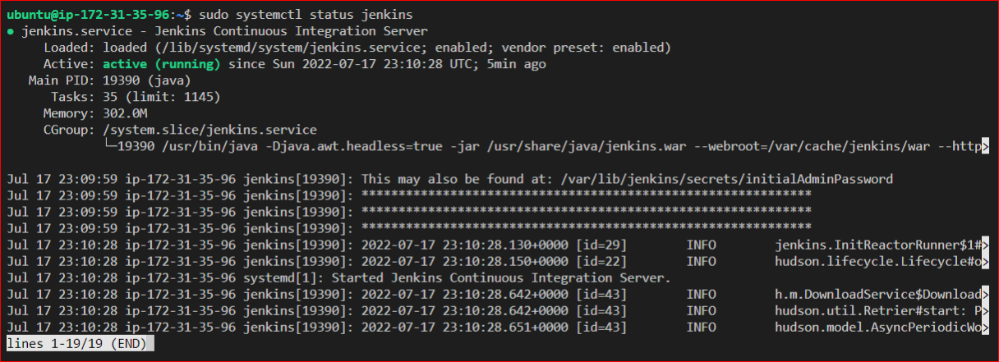
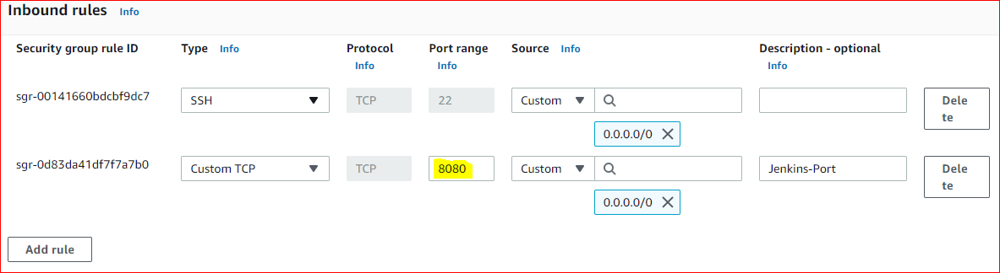
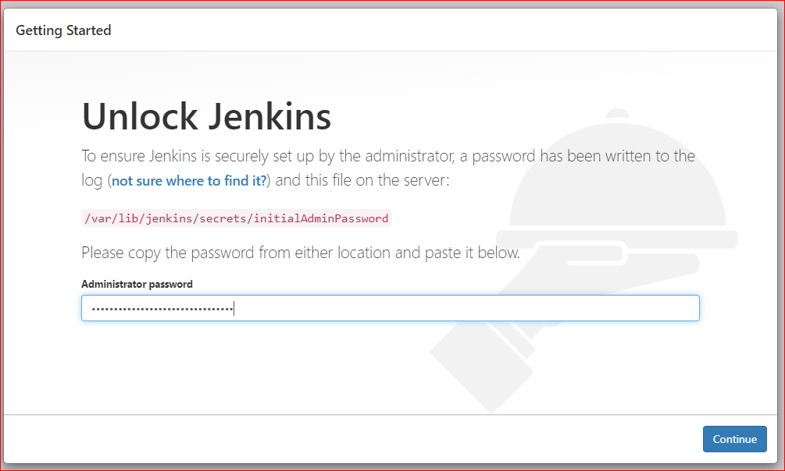
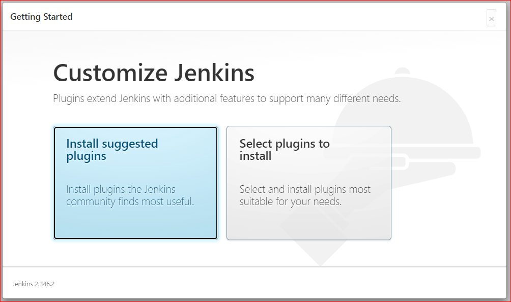
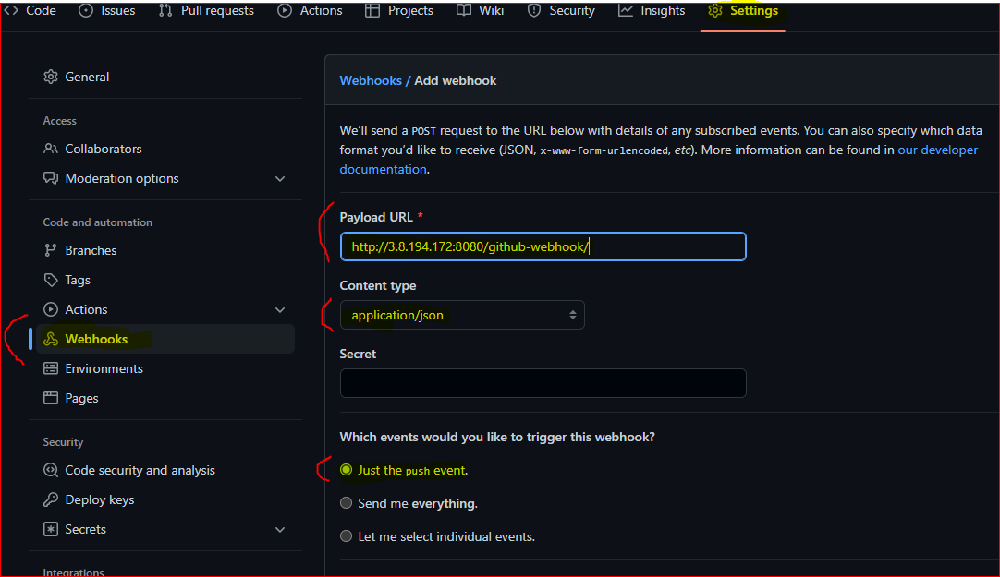

## Continous Integration Pipeline For Tooling Website
---
**Task**

I'll enhance the architecture prepared in **Project 8** (https://github.com/Amae69/devops-pbl/blob/d41ce9abb64ab44f07c89c07781261243e6821b3/Project8.md) by adding a **Jenkins server**, 

I'll configure a job to automatically deploy source codes changes from **Git** to **NFS server**.

**Project Architecture:**

 

### Step 1 – Install Jenkins server
---
- I create an AWS EC2 server based on **Ubuntu Server 20.04 LTS** and name it **"Jenkins"**

  

- Install **JDK**

  `sudo apt update`

  `sudo apt install default-jdk-headless`

- Install Jenkins 
  ```
  wget -q -O - https://pkg.jenkins.io/debian-stable/jenkins.io.key | sudo apt-key add -
  sudo sh -c 'echo deb https://pkg.jenkins.io/debian-stable binary/ > \
    /etc/apt/sources.list.d/jenkins.list'
  
  sudo apt update

  sudo apt-get install jenkins
  ```
- Check if Jenkins is up and running

  `sudo systemctl status jenkins`

   

- By default **Jenkins** server uses TCP port **8080** – I opened it by creating a new Inbound Rule in my EC2 Security Group

   

- I'll Perform the initial **Jenkins** setup.
  ```
  From my browser i'll access:
  
  http://<Jenkins-Server-Public-IP-Address-or-Public-DNS-Name>:8080   
  ```
- Retrieve my default admin password and Login to Jekins server:

  `sudo cat /var/lib/jenkins/secrets/initialAdminPassword`  

  

- To get started i will select to install **suggested plugins** 
  
  
  

- Once plugins installation is done, i'll create an admin user and i'll will get my Jenkins server address

  

### **Step 2 – Configure Jenkins to retrieve source codes from GitHub using Webhooks**
---

In this step, i'll configure a simple Jenkins job/project. 

This job will be triggered by **GitHub webhooks** and will execute a **‘build’** task to retrieve codes from **GitHub** and store it locally on **Jenkins server**. 

- I'll enable webhooks in my GitHub repository.

  Go to my GitHub: Settings > Webhooks > Add webhooks > Jenkins server URL (http://3.8.194.172:8080/github-webhook/)

  

- I'll go to Jenkins web console on my browser, click **"New Item"** and create a **"Freestyle project"**


 


  


